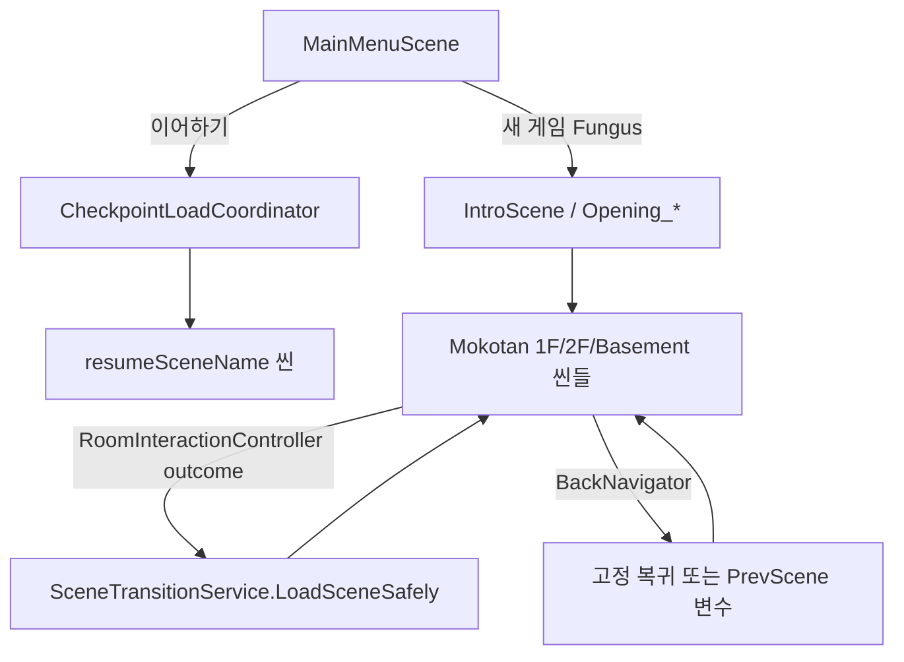
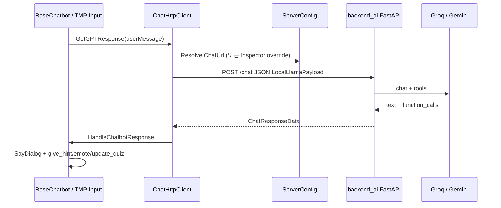
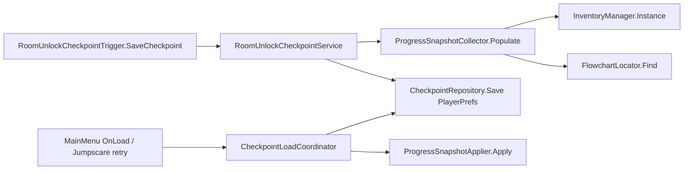
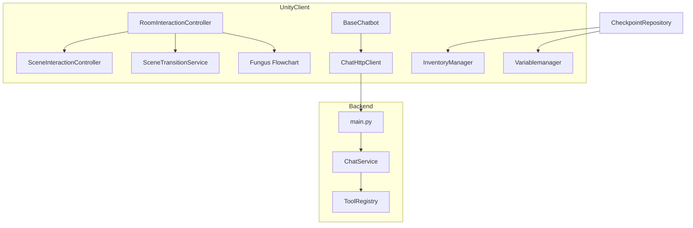

# newCapstone 아키텍처 문서

> **목적**: Cursor/AI가 새 기능을 추가할 때 따를 **코드베이스 기준 문서**입니다.  
> **원칙**: 이 문서는 저장소를 직접 조사한 내용만 기록합니다. 추측·일반론은 §8(미확인 사항)으로 분리합니다.

---

## 1. 프로젝트 개요

### 이 앱이 무엇을 하는지

**newCapstone**은 2D 미스터리·스릴러 **Unity 게임**과, 게임 내 AI 챗봇(체셔 앵무·튜터 등)을 위한 **HTTP 백엔드**로 구성된 모노레포입니다.

| 구성요소 | 역할 |
|----------|------|
| `disputatio/` | Unity 6 클라이언트. 저택 탐색, Fungus 대화/시퀀스, 퍼즐, 인벤토리, AI 챗 UI |
| `backend_ai/` | FastAPI AI 서버. `/chat`, `/chat/stream`, `/tutor/grade` 제공 |
| `scripts/` | CI용 C# 구문 검사기, 오류 수집 스크립트 등 |
| `deploy/` | 운영 Docker Compose, Caddy, 배포 후 헬스체크 스크립트 |

게임 제품명(Inspector): **The Unholy of Mention** (`disputatio/ProjectSettings/ProjectSettings.asset`).  
README에는 **민원 번호 33**으로도 표기되어 있습니다.

플레이어는 씬(방·복도) 단위로 이동하며, **Fungus Flowchart**로 대사·연출을 진행하고, **C# 상호작용 레이어**(`Godlotto.Interaction`)가 클릭·씬 전환·패널을 조율합니다. AI 대화는 Unity `UnityWebRequest` → `backend_ai` `POST /chat`으로 처리되며, 서버가 반환하는 **function call**(`give_hint`, `emote`, `update_quiz` 등)을 클라이언트가 게임 액션으로 변환합니다.

### 주요 기술 스택

| 영역 | 스택 (코드·설정에서 확인) |
|------|---------------------------|
| 게임 엔진 | Unity **6000.0.36f1** (Unity 6), URP (`com.unity.render-pipelines.universal` 17.0.3) |
| 대화·시퀀싱 | **Fungus** (`disputatio/Assets/Fungus/`) |
| 입력 | Input System (`com.unity.inputsystem`) |
| JSON | Newtonsoft (`com.unity.nuget.newtonsoft-json`) |
| AI 클라이언트 | `BaseChatbot` → `ChatHttpClient` (`disputatio/Assets/mokotan/mokotan/script/AI/`) |
| AI 서버 | **FastAPI** + uvicorn, **Groq**(우선) / **Gemini**(폴백) |
| 클라이언트 영속화 | **PlayerPrefs** (체크포인트 JSON, 설정), Fungus 변수(`Variablemanager` Flowchart) |
| 서버 데이터 | CSV 문제은행, RAG JSON 인덱스, (선택) **Redis** rate limit |
| CI | GitHub Actions: Python ruff/py_compile, C# syntax checker, backend pytest + Docker |
| 배포 | GHCR 이미지 → EC2 SSH + `docker compose` (`deploy/docker-compose.prod.yml`) |

---

## 2. 디렉터리 구조

### 저장소 루트

```
newCapstone/
├── disputatio/          # Unity 프로젝트 (게임 본체)
├── backend_ai/          # FastAPI AI 백엔드
├── scripts/             # CI·로컬 보조 도구 (CSharpSyntaxChecker, collect-errors.py 등)
├── deploy/              # 운영 compose, Caddy, postdeploy 스크립트
├── docs/                # 기획·마이그레이션·본 아키텍처 문서
├── .github/workflows/   # CI/CD
└── README.md
```

### Unity (`disputatio/Assets/`) — 코드를 넣을 위치

| 경로 | 책임 | 새 코드 추가 시 |
|------|------|-----------------|
| `Assets/godlotto/Script/` | **팀 핵심 게임 로직**: 인벤토리, 체크포인트, 설정, 씬 네비, Fungus 커스텀 커맨드 | 대부분의 게임play·UI·세이브 기능 |
| `Assets/godlotto/Script/Interaction/` | **씬 상호작용 프레임워크** (`Godlotto.Interaction`) | 방/복도 클릭, Fungus 블록 실행, 씬 전환 outcome |
| `Assets/godlotto/Script/Checkpoint/` | PlayerPrefs 체크포인트 저장·복원 | 이어하기, 방 해금 스냅샷 |
| `Assets/godlotto/Script/Constants/` | `SceneNames`, `FungusVariableKeys` | 씬·변수 이름 상수 (매직 스트링 금지) |
| `Assets/godlotto/Script/Core/` | `SingletonMonoBehaviour`, `GameLog` | 씬 간 유지 싱글톤, dev 로그 |
| `Assets/godlotto/Script/Config/` | `ServerConfig` ScriptableObject | AI 서버 URL 기본값 |
| `Assets/godlotto/Script/Editor/` | 씬 마이그레이션·에디터 도구 | Fungus→C# 마이그레이션, 씬 일괄 수정 |
| `Assets/godlotto/KTH/` | 점프스care, 이펙트, 실험적 씬 스크립트 | 공포 연출·특수 씬 |
| `Assets/mokotan/mokotan/script/AI/` | **AI 챗봇** (`BaseChatbot` 파생) | 방별 챗봇, HTTP, 휴리스틱 |
| `Assets/mokotan/mokotan/script/AI/Heuristics/` | 힌트 난이도·재방문 추적 | AI 컨텍스트 신호 |
| `Assets/mokotan/MapSP/scr/` | 미니맵·씬 이동 UI | 맵에서 방 이동 |
| `Assets/Scenes/` | **모든 플레이 씬** | 씬 에셋·Flowchart 배치 (로직은 Script에) |
| `Assets/Editor/Tests/EditMode/` | **EditMode 단위 테스트** | 순수 C# 로직 테스트 |
| `Assets/Fungus/` | 서드파티 Fungus (수정 최소화) | Fungus 코어 변경 지양 |
| `Assets/Resources/` | `ServerConfig`, 프롬프트 txt 등 | 런타임 `Resources.Load` 대상 |

### 백엔드 (`backend_ai/`)

| 경로 | 책임 |
|------|------|
| `main.py` | FastAPI 앱, 라우트, lifespan(rate limiter) |
| `config.py` | `.env` 로드, 한도·튜터 RAG 설정 |
| `models/` | `ChatRequest`, `ChatResponse`, `TutorGradeRequest` |
| `providers/` | Groq / Gemini 어댑터 |
| `services/` | `chat_service`, RAG, quiz bank, rate limit |
| `tools/` | LLM function schema (`game_tools.py`) |
| `llm_defense/` | 입력 sanitize, message builder |
| `data/tutor_quiz/` | `quiz_bank.csv` |
| `data/tutor_rag/` | RAG 코퍼스 md/txt |
| `tests/` | pytest |

### 네임스페이스 규칙 (실제 코드)

- **`Godlotto.Interaction`**: `RoomInteractionController`, `SceneTransitionService`, `SceneInteractionController` 등
- **`Godlotto.FungusIntegration`**: `GuardedClickable2D` 등
- **그 외 godlotto/mokotan 대부분**: 전역 네임스페이스 (클래스명만으로 참조)

---

## 3. 실행 흐름

### 앱 시작점

1. **빌드 첫 씬**: `Assets/Scenes/godlotto/MainMenuScene.unity`  
   (`disputatio/ProjectSettings/EditorBuildSettings.asset` index 0)
2. **`MainMenu`** (`disputatio/Assets/godlotto/Script/MainMenu.cs`):
   - **새 게임**: `PlayDataPrefsCleaner.ClearProgressPreserveAudioVideoSettings()` — 진행만 초기화, BGM/SFX/해상도 PlayerPrefs 유지
   - **이어하기**: `CheckpointLoadCoordinator.LoadLatestOrFallback(SceneNames.MainScene)`
   - 실제 **새 게임 씬 전환**은 Inspector에서 버튼→Fungus 블록 연결로 처리 (`MainMenu.OnStartButton`은 PlayerPrefs 정리만 수행)
3. **씬 로드 시 공통**:
   - `VariablemanagerSingleton` — `DontDestroyOnLoad`로 전역 Flowchart 오브젝트 유지
   - `SceneNameSetter` — Fungus `SceneName`, `SavePointKey` 갱신
   - `InventoryManager` — `PersistAcrossScenes == true` 싱글톤

### 씬/“라우트” 흐름 (웹 라우트 없음 → Unity SceneManager)

게임에는 URL 라우팅이 없습니다. **씬 이름 = 라우트**입니다. 상수는 `SceneNames`에 정의합니다.

```csharp
// disputatio/Assets/godlotto/Script/Constants/SceneNames.cs
public const string MainMenu = "MainMenuScene";
public const string Kitchen = "Kitchen";
public const string StudyRoom = "StudyRoom";
// ...
```

**대표 플로우 (빌드 설정·코드 기준)**



**씬 전환 진입점 (우선순위)**

| 메커니즘 | 파일 | 용도 |
|----------|------|------|
| `SceneTransitionService.LoadSceneSafely` | `godlotto/Script/Interaction/SceneTransitionService.cs` | 중복 LoadScene 방지 (권장) |
| `RoomInteractionController` BlockOutcome | `godlotto/Script/Interaction/RoomInteractionController.cs` | Fungus 블록 종료 후 loadScene / goBack |
| `BackNavigator.GoBack` | `godlotto/Script/BackNavigator.cs` | 고정 복귀 테이블 또는 `PrevScene` Fungus 변수 |
| `SceneManager.LoadScene` (직접) | 여러 레거시·맵 UI | 점진적으로 Interaction 레이어로 이전 중 |

**복귀 고정 테이블 예** (`BackNavigator.TryResolveFixedReturnScene`):

- `StudyRoom` / `MaidRoom` → `Hallway_Right`
- `BedRoom` / `WifeRoom` → `2floorHallway_Right`
- `TutorRoom` / `ChildRoom` → `2floorHallway_Left`
- `2floorMainHall` → `Hall_playerble`

### 클라이언트 ↔ 서버 관계



- **URL 해석**: `BaseChatbot.Start()` → `localServerUrl` 비어 있으면 `ServerConfig.GetOrCreate().ChatUrl`  
  (`disputatio/Assets/godlotto/Script/Config/ServerConfig.cs`, 기본값 `http://15.134.24.132:8000/chat`)
- **튜터 채점**: `TutorQuizGrader`가 `/chat` URL에서 `/tutor/grade`로 치환해 `POST` (LLM 없이 CSV 채점)

---

## 4. 데이터 흐름

### 영속화 계층 (DB 없음 — 클라이언트)

| 저장소 | 키/형식 | 담당 코드 | 내용 |
|--------|---------|-----------|------|
| PlayerPrefs | `Checkpoint.Latest.v1` | `CheckpointRepository` | JSON `CheckpointSaveData` |
| PlayerPrefs | `BGMVolume`, `SFXVolume`, `Fullscreen`, `ResolutionIndex` | `SettingPlayerPrefsKeys` | 설정 (진행 초기화 시 **유지**) |
| Fungus Flowchart | `Variablemanager` GameObject | `FlowchartLocator`, `ProgressSnapshotCollector` | bool/int/string 게임 상태 |
| Fungus SaveManager | `persistentDataPath/FungusSaves/` | Fungus 내장 | 에디터에서 `PlayDataPrefsCleaner`가 삭제 가능 |
| ScriptableObject | `Assets/godlotto/Item/*.asset` | `Item` | 인벤토리 아이템 정의 |

**체크포인트 CRUD**



**`CheckpointSaveData` 필드** (`godlotto/Script/Checkpoint/CheckpointSaveData.cs`):

- `resumeSceneName`, `checkpointId`, `checkpointType`, `unlockedRoomKey`
- `itemIds[]`, `fungusBooleans[]`, `fungusIntegers[]`, `fungusStrings[]`

**방 해금 체크포인트 정의** (`RoomCheckpointDefinition.cs`):  
`ElectricOn`→Kitchen, `UsedStudyKey`→StudyRoom, … `UsedBedKey`→BedRoom (Order 10~70)

### 런타임 상태 (세션)

| 상태 | 위치 | 비고 |
|------|------|------|
| 대화·플래그 | Fungus `Variablemanager` | `FungusVariableKeys.*` 상수로 접근 |
| 인벤토리 슬롯 | `InventoryManager` | `DontDestroyOnLoad` |
| AI 대화 기록 | `ChatHistoryManager` | `BaseChatbot` 인스턴스별 |
| 상호작용 차단 | `InteractionInputGate`, `SceneInteractionController` | 대사 중·씬 전환 중 클릭 차단 |
| 씬 전환 플래그 | `SceneTransitionService` static | `IsTransitionPending` |

### API 호출 구조 (백엔드)

| 메서드 | 경로 | 요청 모델 | 응답 |
|--------|------|-----------|------|
| GET | `/` | — | `{ status, message }` |
| POST | `/chat` | `ChatRequest` | `ChatResponse` (text + function_calls) |
| POST | `/chat/stream` | `ChatRequest` | SSE |
| POST | `/tutor/grade` | `TutorGradeRequest` | `TutorGradeResponse` (LLM 없음) |

**Unity → `/chat` JSON** (`ChatHttpClient.LocalLlamaPayload`):

- `prompt`, `system`, `use_tools`, `message`, `user_id`
- 튜터: `rag_profile`, `rag_query`, `current_question_id`

**서버 function tools** (`backend_ai/tools/game_tools.py`):

- `give_hint` — Unity에서 오브젝트 강조 등
- `emote` — 앵무 감정
- `update_quiz` — TutorRoom 퀴즈 진행

**인증**: 클라이언트→서버 **사용자 로그인/토큰 없음**. 서버는 API 키(`GROQ_API_KEY`, `GOOGLE_API_KEY`)를 `.env`에서만 읽고, `rate_guard`로 IP/`user_id` 해시 rate limit (429).

---

## 5. 주요 모듈 설명

### Interaction 레이어 (`Godlotto.Interaction`)

**역할**: Fungus는 **대사·Say·Menu**만; 클릭 라우팅·씬 load·`isClicked` 정리는 C#.

| 클래스 | 역할 |
|--------|------|
| `SceneInteractionController` | `TryInteract(id)` — 연타·대사 중·전환 중 차단 |
| `RoomInteractionController` | `interactionId` → Fungus block; `BlockOutcome` → 씬/load/back |
| `CorridorEntranceController` | 복도·입구 씬용 `RoomInteractionController` 파생 |
| `FungusDialogueBridge` | Flowchart 블록 안전 실행 |
| `SceneTransitionService` | LoadScene 중복 방지 |
| `InteractionInputGate` | 시퀀스 중 입력 전역 차단 |
| `ClickInteractionCleanup` | `isClicked` / UI 경계 후 정리 |

**의존**: Fungus `Flowchart`, `BlockSignals` ← C# controller ← UI/월드 Collider2D

### AI 챗 (`mokotan/.../AI/`)

| 클래스 | 역할 |
|--------|------|
| `BaseChatbot` | SayDialog, 입력, HTTP coroutine 진입 |
| `ChatHttpClient` | `/chat`, `/chat/stream` transport |
| `ChatHistoryManager` | system prompt·히스토리·ChesterVoiceCommon |
| `GlobalChatbot` | `give_hint`, `emote` 공통 처리 |
| `TutorChatbot` | RAG 프로필, 퀴즈, `/tutor/grade` |
| `*RoomChatbot` | 방별 system prompt·휴리스틱 (`StudyRoomChatbot`, `WifeRoomChatbot`, …) |
| `ParretPanelChatbotBinder` | 씬별 챗봇 타입 바인딩 |

### 게임 코어 (`godlotto/Script/`)

| 클래스 | 역할 |
|--------|------|
| `InventoryManager` | 아이템 CRUD UI, Tab 토글, Fungus `pressTab` |
| `Item` / `ItemPickup` | ScriptableObject 아이템, `itemId` 1~30 |
| `FlowchartLocator` | `"Variablemanager"` Flowchart 탐색 |
| `VariablemanagerSingleton` | 전역 Flowchart GO `DontDestroyOnLoad` |
| `AudioController` | BGM 등 (`SingletonMonoBehaviour`) |
| `OpeningMentionController` | 오프닝 씬 Bell/Fence (Interaction 패턴 예시) |
| `WifeRoomPuzzleController` | 방 전용 퍼즐 (RoomInteractionController 확장) |

### 백엔드

| 모듈 | 역할 |
|------|------|
| `ChatService` | provider fallback, tool 주입, tutor RAG |
| `TutorRAGService` | `tutor_rag_index.json` 검색 |
| `QuizBank` | CSV 로드 |
| `answer_grader` / `tutor_grade` | `/tutor/grade` |
| `rate_limit` + `rate_guard` | Redis 또는 in-process window |

### 의존성 다이agram (요약)



---

## 6. 아키텍처 규칙

### 새 기능 추가 시 따라야 할 규칙

1. **씬 이름**은 `SceneNames`에 상수 추가 후 사용 (`godlotto/Script/Constants/SceneNames.cs`).
2. **Fungus 변수 키**는 `FungusVariableKeys`에 추가 (`godlotto/Script/Constants/FungusVariableKeys.cs`).
3. **방/복도 클릭·씬 전환**은 새 Fungus `LoadScene` 커맨드 대신 **`RoomInteractionController` + BlockOutcome** 패턴을 따릅니다. 기존 마이그레이션 참고: `godlotto/Script/Editor/CorridorEntranceSceneMigrator.cs`, `docs/fungus-room-migration-plan.md`.
4. **씬 load**는 `SceneTransitionService.LoadSceneSafely` 사용.
5. **클릭 진입** 전 `SceneInteractionController.TryInteract(interactionId)` 호출.
6. **로그**는 릴리스에 남기지 않을 진단은 `GameLog.Log` (`Core/GameLog.cs`); 실제 버그는 `Debug.LogError` 유지.
7. **싱글톤 매니저**는 `SingletonMonoBehaviour<T>` + `PersistAcrossScenes` override (`Core/SingletonMonoBehaviour.cs`).
8. **AI URL**은 `Resources/ServerConfig` 에셋 또는 chatbot Inspector `localServerUrl`; 하드코딩 시 테스트 `ServerConfigTests`와 불일치 주의.
9. **체크포인트에 넣을 Fungus 키**는 `ProgressSnapshotPolicy` / `ProgressSnapshotCollector`의 capture 목록과 맞출 것.
10. **테스트**: EditMode 순수 로직 → `Assets/Editor/Tests/EditMode/`; 백엔드 → `backend_ai/tests/`.

### 파일 위치·네이밍

| 추가 대상 | 위치 | 네이밍 예 |
|-----------|------|-----------|
| 방 상호작용 | `godlotto/Script/Interaction/` | `*InteractionController`, `*PuzzleController` |
| Fungus 커맨드 | `godlotto/Script/FungusCommands/` | 동사형 (`SetBloom`, `PlayRegisteredSfx`) |
| 방별 AI | `mokotan/mokotan/script/AI/` | `{Room}Chatbot : BaseChatbot` |
| 상수 | `godlotto/Script/Constants/` | `*Keys`, `SceneNames` |
| 에디터 마이그레이션 | `godlotto/Script/Editor/` | `*SceneMigrator` |
| API·서비스 | `backend_ai/services/` | `*_service.py` |
| LLM tool schema | `backend_ai/tools/game_tools.py` + `registry` |

### 상태 관리 패턴

- **글로벌 진행**: Fungus bool/int/string on `Variablemanager` + 필요 시 `CheckpointSaveData` 스냅샷.
- **UI/세션**: MonoBehaviour 필드 + `InteractionInputGate`.
- **설정**: PlayerPrefs (`SettingPlayerPrefsKeys`만 — 키 문자열 변경 금지, 주석에 명시).
- **AI 대화**: 인스턴스별 `ChatHistoryManager` (씬마다 chatbot 컴포넌트).

### API 호출 패턴

- Unity: **Coroutine** + `UnityWebRequest` — `ChatHttpClient`만 수정; UI에서 직접 HTTP 금지.
- Payload 확장: `BaseChatbot.AugmentChatPayload` override → `LocalLlamaPayload` 필드 추가 → backend `ChatRequest` 동기화.
- 새 tool: `backend_ai/tools/game_tools.py` 등록 → `GlobalChatbot.ProcessCommonFunctionCalls` 또는 방별 `HandleChatbotResponse`에서 dispatch.

### 피해야 할 패턴

- Fungus 블록에 **LoadScene + isClicked 수동 정리** (Interaction 레이어와 이중·경쟁).
- `GameObject.Find` 남발 — Flowchart는 **`FlowchartLocator`**.
- `Debug.Log` 남발 — **`GameLog`** 사용.
- `SceneManager.LoadScene` 직접 호출로 **전환 중복** ( `SceneTransitionService` 우회).
- `PlayerPrefs.DeleteAll()` without preserving settings — **`PlayDataPrefsCleaner`** 패턴 사용.
- `Assets/Fungus/` 서드파티 **대규모 수정** (업스트림 merge 불가).
- API 키를 Unity/저장소에 **커밋**.

---

## 7. 확장 가이드

### 새로운 “페이지”(씬) 추가

1. **씬 에셋** 생성: `Assets/Scenes/Mokotan/.../MyRoom.unity`
2. **`EditorBuildSettings`에 등록**: `ProjectSettings/EditorBuildSettings.asset` (Unity Build Settings UI)
3. **`SceneNames`에 상수 추가**
4. **전역 Flowchart** 변수·블록 배치; `Variablemanager` 프리팹/씬 지속 확인
5. **상호작용**:
   - 단순 복도/방: `RoomInteractionController` 또는 `CorridorEntranceController` 컴포넌트 + Inspector `InteractionRoute[]`, `BlockOutcome[]`
   - 특수 퍼즐: `RoomInteractionController` 상속 (예: `WifeRoomPuzzleController.cs`)
6. **복귀 경로**: `BackNavigator.TryResolveFixedReturnScene`에 case 추가 또는 Fungus `PrevScene` 설정
7. **체크포인트(선택)**: `RoomCheckpointDefinition.Definitions` + `RoomUnlockCheckpointTrigger` on Fungus 이벤트
8. **EditMode 테스트** 추가: `Assets/Editor/Tests/EditMode/...`

### 새로운 API 추가 (백엔드)

1. **`models/requests.py` / `responses.py`**에 Pydantic 모델
2. **`main.py`**에 라우트 등록
3. 로직은 **`services/`**에 분리 (`ChatService`와 동일 패턴)
4. **`tests/test_*.py`** 작성
5. Unity 연동 시: `ChatHttpClient` 또는 전용 클라이언트 클래스 + EditMode 테스트
6. **`backend_ai/README.md`** API 표 업데이트 (팀 문서; 선택)

**예: 기존 채점 API**

- 서버: `POST /tutor/grade` — `main.py`, `services/tutor_grade.py`
- 클라이언트: `TutorQuizGrader.cs` — URL은 chat endpoint에서 `/tutor/grade`로 치환

### 새로운 데이터 모델 추가

| 종류 | 절차 |
|------|------|
| **인벤토리 아이템** | `Item` ScriptableObject (`Assets/godlotto/Item/`), 고유 `itemId` 1~30, `ItemAcquisitionTracker` 연동 |
| **체크포인트 필드** | `CheckpointSaveData` 필드 추가 → Collector/Applier/Policy → `CheckpointRepositoryTests` |
| **Fungus 플래그** | `FungusVariableKeys` + Flowchart 변수 선언 + Collector boolean/int/string 배열 |
| **튜터 퀴즈** | `backend_ai/data/tutor_quiz/quiz_bank.csv` + `validate_quiz_bank.py` |
| **RAG 문서** | `backend_ai/data/tutor_rag/*.md` + `build_tutor_rag_index.py` |
| **LLM tool** | `game_tools.py` + Unity `HandleChatbotResponse` / `ProcessCommonFunctionCalls` |

---

## 8. 미확인 사항

코드만으로 **확실히 단정할 수 없거나 불일치**가 있는 항목입니다.

| 항목 | 관찰 | 추가 확인 방법 |
|------|------|----------------|
| **`SceneNames.MainScene` ("MainScene")** | `MainMenu` 이어하기 fallback, Jumpscare retry에 사용되나 **`MainScene.unity` 파일 없음**, `EditorBuildSettings`에도 없음 | 의도된 fallback 씬명(예: `Hall_playerble`) 확인; 상수·빌드 설정 정렬 |
| **새 게임 시작 씬** | `MainMenu.OnStartButton`은 PlayerPrefs만 지우고 **LoadScene 호출 없음** — 실제 전환은 Fungus/버튼 Inspector | `MainMenuScene.unity` Flowchart·Button onClick 추적 |
| **`IntroScene` vs `Opening_Office`** | 빌드 목록에 둘 다 존재; 정확한 오프닝 순서는 씬 내 Flowchart 의존 | 플레이through 또는 Fungus 블록 문서화 |
| **Fungus Save Point vs Checkpoint** | `SaveManager`/`SavePointKey`와 `CheckpointRepository` **병존**; 어떤 메뉴가 어느系를 쓰는지 코드만으로 단일 정책 불명 | 기획·`docs/superpowers/plans/2026-05-11-remove-custom-save-system.md`와 런타임 확인 |
| **`resumeSpawnId`** | `CheckpointSaveData`에 필드 있으나 **`ProgressSnapshotApplier`에서 spawn 적용 코드 미확인** | 스폰 시스템 존재 여부 씬 검색 |
| **운영 HTTPS URL** | `ServerConfig` 기본 IP, `deploy/Caddyfile` 도메인은 코드만으로 Unity 클라이언트 최종 URL 불명 | 배포 환경·Inspector ServerConfig 에셋 |
| **Redis in prod** | `REDIS_URL` 비면 in-process rate limit (멀티 replica 부적합) — 운영 `.env` 미포함 | 서버 `/opt/newcapstone/.env` |
| **WebGL 빌드** | `deploy/serve_webgl_brotli.py` 존재; 게임 WebGL 배포 파이프라인은 본 문서 범위에서 미검증 | 빌드 타겟·CI 확인 |

---

## 부록: 자주 쓰는 코드 경로

| 작업 | 경로 |
|------|------|
| 메인 메뉴 | `disputatio/Assets/godlotto/Script/MainMenu.cs` |
| 빌드 씬 목록 | `disputatio/ProjectSettings/EditorBuildSettings.asset` |
| 씬 전환 | `disputatio/Assets/godlotto/Script/Interaction/SceneTransitionService.cs` |
| 방 클릭 | `disputatio/Assets/godlotto/Script/Interaction/RoomInteractionController.cs` |
| 체크포인트 저장 | `disputatio/Assets/godlotto/Script/Checkpoint/CheckpointRepository.cs` |
| AI HTTP | `disputatio/Assets/mokotan/mokotan/script/AI/ChatHttpClient.cs` |
| AI 서버 URL | `disputatio/Assets/godlotto/Script/Config/ServerConfig.cs` |
| FastAPI 진입 | `backend_ai/main.py` |
| LLM tools | `backend_ai/tools/game_tools.py` |
| CI (C#) | `.github/workflows/ci-check.yml` → `scripts/CSharpSyntaxChecker/` |
| CI (backend) | `.github/workflows/backend-build.yml` |
| 배포 | `.github/workflows/deploy-backend.yml`, `deploy/docker-compose.prod.yml` |
| EditMode 테스트 | `disputatio/Assets/Editor/Tests/EditMode/` |
| Fungus 마이그레이션 계획 | `docs/fungus-room-migration-plan.md` |

---

*문서 버전: 저장소 조사 기준 2026-06-06. 변경 시 §8 불일치 항목부터 재검증하세요.*
