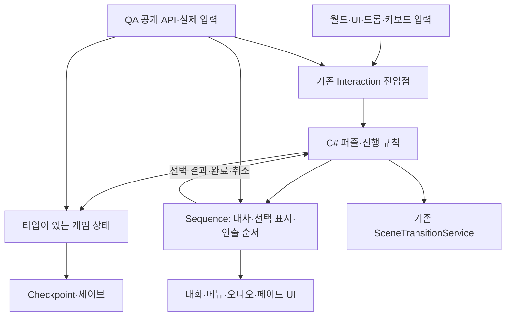

# Fungus 완전 제거 및 전체 씬 프레임워크 재정립 실행 계획

> 실행자: Cursor Agent / 사용자 지정 모델 **Composer 2**. 이 문서는 전체 작업의 기준이며, 실제 수정은 아래 작업 패킷 단위로 수행한다. 계획 실행 시 `superpowers:executing-plans` 또는 저장소의 동등한 실행 절차를 적용한다. 새로운 가상 에이전트 조직이나 자동 위임을 만들지 않는다.

- 작성일: 2026-09-17
- 상태: P0 G0 문서 게이트 충족 (2026-09-17, `feature/fungus-deletion-framework`). 플레이 미검증. P1 미착수
- 대상 저장소: `D:/Capstone/newCapstone`; Unity 프로젝트: `disputatio/`
- Goal: **전체 씬·공용 프리팹·전역 상태·저장·대화·QA에서 Fungus 의존성을 제거하고, 책임과 수명주기가 명확한 C# 프레임워크로 통일한다.**
- Architecture: 게임 규칙은 C# 도메인 로직, 상태는 타입이 있는 단일 저장소, 연출 순서는 제한된 Sequence 데이터, 입력·전환·저장은 각 기존 서비스의 명시적 계약이 소유한다.
- Tech Stack: 현재 저장소의 Unity 6000.0.36f1, C#, 기존 JSON 라이브러리, NUnit, 현재 활성 Unity 하네스. 이 작업에서 엔진/입력 패키지/백엔드를 함께 교체하지 않는다.
- Spec: `docs/superpowers/specs/2026-09-17-fungus-deletion-runtime-design.md`의 삭제 목표·동결을 유지한다. **본 문서의 전체 씬 범위, 책임 분리, 게이트와 최종 AC가 기존 Kitchen 우선 단계와 충돌하면 본 문서를 적용한다.**
- Entry: `docs/development/tasks/fungus-deletion/index.md`

## 0. 범위와 문서의 의미

### 0.1 전체 씬이 목적이다

Kitchen 하나의 클리어, Sequence 단위 테스트 통과, 일부 방의 Flowchart 제거는 전체 완료가 아니다. Kitchen은 대표 검증 대상으로 선택할 수 있는 여러 씬 중 하나이며, 필수 선행 방이나 전체 설계의 중심이 아니다.

전체 작업은 다음 집합을 관리한다.

1. Build Settings의 활성·비활성 씬, `Assets` 아래의 모든 `.unity` 씬.
2. 코드·데이터·Resources·Addressables 등에서 동적으로 로드되는 씬과 프리팹. 해당 로딩 수단의 실제 사용 여부부터 확인한다.
3. 씬이 공유하는 프리팹/변형 프리팹, DontDestroyOnLoad 객체, 시작·로딩·메뉴·엔딩·테스트 씬.
4. 게임·Editor·테스트·QA 코드, asmdef, 직렬화된 UnityEvent, ScriptableObject, 대사/번역/오디오/폰트 등 간접 자산.
5. 세이브·Checkpoint·설정·locale·인벤토리·퀘스트·AI UI의 Fungus 연결.

이전 대상 목록을 줄여 완료율을 올리지 않는다. 미사용 씬도 `유지하여 이전` 또는 `근거를 남기고 폐기`로 처리한다. 도달 불가라는 이유만으로 사용자 콘텐츠를 삭제하지 않는다. 폐기 범위가 확인되지 않은 자산은 유지 대상으로 취급한다.

### 0.2 현재 확인된 출발점

- 기존 Sequence 코드: `FlagStore.cs`, `SequenceDocument.cs`, `SequencePlayer.cs`, `SequencePlayException.cs`.
- 기존 index의 기록: FlagStore 5개, SequencePlayer 8개 EditMode 테스트 통과. 이번 문서 작성에서 재실행하지 않았으며 전체 이전 증거가 아니다.
- 현재 FlagStore는 타입별 사전이 분리되어 동일 키의 타입 충돌을 허용한다. Sequence는 동기 실행이며 입력 문서 전체 검증, 취소·비동기 실행·저장 연동 계약은 아직 부족하다.
- Hall 경로는 `Hall_playerble → Hall_Left → Hall_Left2 → Kitchen`이며 C# 상호작용과 Fungus 종료/LoadScene 책임이 섞여 있다. 조사 당시 해당 월드 타깃은 legacy Clickable2D 입력이다. 다른 씬에도 같은 입력 방식이라고 가정하지 않는다.
- 과거 수치(Flowchart 약 56개, 블록 약 399개, 참조 약 100파일)는 기준 inventory가 아니다. P0에서 현재 revision으로 다시 센다. Flowchart 개수와 씬 개수를 혼동하지 않는다.
- 미커밋 QA 수정과 다른 실행자의 변경이 있을 수 있다. 시작 시 status/diff를 읽고 보존한다. 본 계획이 타인 변경 폐기를 허가하지 않는다.

### 0.3 공통 제약

- `AGENTS.md`, `docs/development/feature-workflow.md`, `.harness/unity-policy.md`, `.harness/unity-verification.md`를 따른다.
- 새 Fungus 블록/Command 상속/벤더 패치/Fungus 전용 QA 확장을 하지 않는다.
- 영구적인 SceneMigrator, 새 글로벌 Manager, Flowchart와 새 상태의 상시 이중 기록을 만들지 않는다.
- 정상 플레이어 세이브로 이전·테스트하지 않는다. 격리와 복원 증거가 없으면 실행 검증은 blocked다.
- 동일 checkout 쓰기는 순차, Unity Editor 담당자는 한 명이다. QA 플레이 중 구현을 멈춘다.
- 커밋·push·merge·배포는 별도 사용자 요청이 있을 때만 한다. 게이트 통과가 이 작업들을 자동 허가하지 않는다.
- 고정 주차를 완료 보증으로 쓰지 않는다. inventory와 대표 경계 이전의 실제 결과로 작업량을 갱신한다.

## 1. 목표 프레임워크: 책임을 다시 나눈다



| 책임 | 단일 소유자 | 금지할 중복 |
|---|---|---|
| 퍼즐 조건·진행 허용·아이템 지급·퀘스트 완료 | 해당 C# 도메인/기존 퍼즐 상태 서비스 | JSON과 C#에 같은 규칙을 따로 구현 |
| 게임 상태의 현재 값 | 타입/범위가 정의된 상태 저장소; 기존 소유자와 통합 | FlagStore와 Variablemanager 양쪽을 현재 값으로 사용 |
| 대사·메뉴 표시·wait·fade·SFX 순서 | Sequence 실행기 + 작은 UI/연출 어댑터 | 임의 C# 실행, 리플렉션 InvokeMethod, 범용 그래프 엔진 |
| 선택의 게임 의미 | C# 규칙; Sequence는 안정된 optionId 결과 반환 | 표시 문자열/첫 버튼 순서로 진행 분기 결정 |
| 입력 잠금 | 기존 InteractionInputGate를 소유 토큰으로 사용 | 각 UI가 전역 bool을 임의로 해제 |
| 씬 전환 | 기존 SceneTransitionService | UI·Sequence·컨트롤러가 각각 LoadScene |
| 저장/복원/이전 버전 처리 | 기존 Checkpoint 계층의 단일 계약 | 여러 컴포넌트의 PlayerPrefs 직접 쓰기 |
| 언어 선택 | 설정/locale 소유자 | Fungus SetLanguage와 새 설정 간 상호 동기화 |
| QA 실행·증거·판정 | 기존 QA 게이트웨이/러너의 정리된 경계 | API 클릭을 실제 입력 검증으로 표시 |

### 1.1 Sequence를 새 Fungus로 만들지 않는 규칙

- 현 단계의 `set_*`/`if_bool`은 실험 기능이다. 그대로 전체 게임 규칙 DSL로 확대하지 않는다.
- P1에서 명령 허용표를 확정한다. 연출 지역 변수·표시 분기는 허용할 수 있지만 영속 퍼즐 플래그 쓰기 권한과 구분한다.
- 인벤토리/퀘스트/씬 이동은 C#의 검증된 요청을 통해 수행한다. 데이터를 통한 무제한 서비스 호출을 금지한다.
- C#이 연출 중 도메인 효과를 실행해야 한다면 명시적 actionId, 입력 타입, 중복 실행 규칙을 가진 좁은 계약으로 한정한다. 범용 문자열 명령 버스를 만들지 않는다.
- 기존 상태 컴포넌트는 읽기용 뷰로 통합하거나 명확한 소유자로 유지한다. 이름만 바꾼 같은 상태 사전을 추가하지 않는다.

### 1.2 현재 코드와 연결할 위치

아래는 탐색 출발점이며 전체 폴더 수정 권한이 아니다. 실행 패킷에서 실제 정의·호출자를 검색해 정확한 파일을 확정한다.

| 영역 | 현재 경로/심볼 | 목표 |
|---|---|---|
| Sequence | `disputatio/Assets/godlotto/Script/Sequence/` | 기존 4파일을 검증·수명주기 계약에 맞춰 정리 |
| Interaction | `disputatio/Assets/godlotto/Script/Interaction/RoomInteractionController.cs` | 타깃 ID → 규칙 요청; Flowchart 실행 책임 제거 |
| 입력/전환 | 같은 폴더 `InteractionInputGate.cs`, `SceneTransitionService.cs` | 기존 서비스 재사용, 중복 락/로드 제거 |
| 퍼즐 상태 | 같은 폴더 `KitchenPuzzleState.cs` 및 각 방의 실제 상태 소유자 | 방마다 권한·중복 지급 규칙 명시 |
| 저장 | `disputatio/Assets/godlotto/Script/Checkpoint/CheckpointRepository.cs` 및 관련 snapshot 코드 | 버전·변환·원자 저장·재진입 |
| 대화 | `disputatio/Assets/mokotan/mokotan/script/StandingDialogue/` | 시각 자산 재사용, Fungus 타입/실행 의존 제거 |
| 메뉴 | `disputatio/Assets/godlotto/Script/FungusCommands/Menu/` | 사용 자산/표시 기능 보존 후 독립 UI로 이동 |
| 기존 시나리오 | `disputatio/Assets/mokotan/mokotan/script/Scenario/ScenarioScript.cs` | 재사용/폐기 판별; 이중 실행기 방지 |
| locale | `disputatio/Assets/mokotan/mokotan/script/AI/Localization/CheshireLocaleResolver.cs` | 설정 소유자로 연결; 별도 localization 규칙 확인 |
| QA | `scripts/qa/`, `disputatio/Assets/mokotan/mokotan/script/QA/` | Fungus 내부 조작 제거, 공개 관찰·취소·증거 계약 재사용 |

## 2. 구현 전에 고정할 계약

### 2.1 상태·세이브

- 키마다 안정된 ID, 타입, 기본값, 범위(게임 전체/씬/시퀀스 지역), 저장 여부, 소유자를 등록한다.
- 동일 ID 다른 타입 등록/쓰기, 공백 키, 미등록 영속 키는 실패한다. 잘못된 읽기를 false/0으로 숨기지 않는다. 정상 초기값과 데이터 오류를 구분한다.
- 세이브는 schemaVersion을 가지며 저장 전 검증, 임시 파일/동등한 원자 교체, 실패 시 이전 원본 보존을 보장한다.
- 기존 세이브 보존을 기본으로 한다. 기존 변수→신규 필드 대응표와 일회성 변환을 만들고 복사본으로 검증한다. 무조건 초기화하거나 silent reset하지 않는다.
- 변환 불가 필드는 이유와 영향을 기록한다. 사용자 데이터 폐기·호환성 단절은 구현자가 임의 결정하지 않는다.
- 씬을 재로드해도 인벤토리·퀘스트·영속 플래그가 중복 생성/지급되지 않는다. 임시 연출 상태는 명시된 규칙대로 초기화한다.
- 부분 이전 기간에도 한 상태를 두 런타임이 동시에 쓰지 않는다. 필요하면 경계에서 한 번 읽어 들이는 단방향 변환을 사용하고 제거할 패킷을 지정한다.

### 2.2 Sequence 실행

- 실행 결과는 Completed / Cancelled / Failed로 구분하고 runId·sequenceId·stepId·오류 코드를 제공한다. 메서드 반환/클릭 접수만으로 완료를 표시하지 않는다.
- 기본 동시성: 동일 상호작용/입력 범위에서는 활성 실행 한 개, 재클릭은 Busy. 임의 큐잉이나 마지막 클릭으로 기존 실행 덮어쓰기를 하지 않는다.
- 비동기 연출은 완료 또는 취소를 기다린다. 씬 이탈, owner 파괴, 명시적 취소, 실패에서 취소가 전파되고 구독·UI·입력 잠금이 finally 경로로 정리된다.
- 잠금은 획득한 실행만 해제한다. 취소 이후 늦게 도착한 콜백은 이전 runId로 상태/씬을 바꾸지 못한다.
- 명령별 timeout과 전체 실행 deadline을 둔다. 대화 사용자 대기는 일반 연출 timeout과 구분하고 QA에서 명시적 입력/취소로 처리한다.
- 실패 시 이미 확정된 도메인 효과를 무조건 되돌리지 않는다. 효과 단위로 원자 적용·idempotency·재실행 정책을 정의한다.
- 분기는 call-and-return인지 jump인지 데이터 계약으로 구분한다. 현재 if_bool은 분기 뒤 원래 블록으로 복귀한다. 혼합 의미를 허용하지 않는다.
- 실행 전 문서 전체를 검증한다: schemaVersion, 중복 ID, 명령/필수 필드/값 타입, 모든 참조, 순환, 최대 깊이/명령 수. 검증 실패 전에는 상태·UI를 바꾸지 않는다.

### 2.3 입력·대화·언어

- 전체 씬 inventory에 실제 입력 경로를 기록한다: UI EventSystem, legacy physics, 드래그/드롭, 키보드 등. 서로 다른 경로를 동일하게 통과한 것으로 기록하지 않는다.
- 입력 방식 통일이 필요한 대상은 명시적 이전 대상으로 잡고 collider/raycaster/focus/UI 가림까지 검증한다. QA를 통과시키려고 런타임에서 몰래 컴포넌트를 덧붙이지 않는다.
- 대사에는 안정된 lineId, 선택지에는 optionId를 사용한다. 한국어 표시 문자열이나 선택지 정렬 순서가 게임 규칙 ID가 되어서는 안 된다.
- 타이핑 스킵/다음 문장/선택 확정/취소를 구분한다. 첫 선택 자동 확정은 기본 동작이 아니다.
- 기존 언어·폰트·줄바꿈·대사 로그·AI 응답 표시를 보존한다. Cheshire의 더 엄격한 localization 규칙이 적용되면 해당 문서를 먼저 읽는다.

## 3. 전체 씬 인벤토리와 진척 관리

P0에서 task 폴더에 `migration-inventory.md`를 만든다. 자산 수가 많을 때만 정렬 가능한 CSV/JSON 하나를 보조 원장으로 추가한다. 같은 상태를 여러 문서에 중복 수기 관리하지 않는다.

### 3.1 씬/자산 원장 필드

```text
assetPath | assetGuid | kind | buildEnabled | reachableFrom
entryPoints | exits | sharedPrefabs | globalDependencies
fungusComponents | blockIds | variableReads | variableWrites
customCommands | inputModes | saveFields | localizationSources
disposition(keep/retire-pending/retired) | migrationPacket
state(planned/running/review/changes-requested/verified/blocked)
oldPathRemoved | evidencePath | independentReview | blocker
```

- 모든 `.unity`를 등록하고, 공용 자산은 별도 행으로 참조한다. 같은 프리팹을 씬 수만큼 이전 완료로 세지 않는다.
- 각 Block/Command는 `C# 규칙으로 이전 / 연출 데이터로 이전 / 기존 서비스로 대체 / 근거 있는 폐기` 중 하나로 분류한다. 분류 없는 항목 0이 P0 게이트다.
- 분기와 이벤트는 발생 원인, 전제 상태, 관찰 결과, 다음 씬/상태를 기록한다. 순서가 중요한 fade/wait/callback을 단순 명령 개수로 치환하지 않는다.
- Fungus 폴더의 `.meta` GUID 목록과 자산의 `m_Script` 참조를 대조한다. 씬 YAML에 `Flowchart` 문자열이 없다고 의존성이 없다고 판정하지 않는다.
- 시작 메뉴/엔딩/공용 UI/미사용 씬도 등록한다. 폐기는 참조와 사용자 콘텐츠 영향을 확인한 뒤 수행한다.

### 3.2 진행률

항상 네 수치를 따로 보고한다.

1. 전체 등록 자산 중 분류 완료/미분류.
2. 유지할 씬 중 검증 완료/구현 중/차단/미착수.
3. 전체 씬 전환 연결 중 검증 완료/미검증.
4. 런타임·Editor·테스트·프리팹·GUID별 남은 Fungus 참조 수.

단위 테스트 개수, 새 코드 파일 수, 한 씬의 PASS를 전체 진행률로 쓰지 않는다. 폐기 수량과 사유도 별도 표시한다.

## 4. 단계별 실행 계획과 게이트

기존 문서의 단계 1은 선행 실험 S1로 보존한다. 아래 P0~P8은 전체 이전 계획의 새 단계이며 번호를 혼용하지 않는다. 아래 체크박스는 문서 작성 시 모두 미완료다.

### P0 — 전체 의존성·행동·검증 기준 확정 (R0 조사, 하네스 수정 시 R3)

**진입:** D 저장소/브랜치/HEAD/미커밋 변경, Editor 소유권 확인.

- [x] 전체 씬·공용 자산·코드/asmdef/GUID 참조 원장을 생성한다.
- [x] 씬 연결 관계와 시작·재진입·엔딩 경로를 작성한다. 동적 로딩 출처도 포함한다.
- [x] 각 Block/변수/커스텀 Command의 처리 방향과 상태 소유자를 매핑한다.
- [x] 기존 실패와 정상 동작을 분리해 기록한다. 이미 깨진 게임 동작을 이전 성공의 기대값으로 고정하지 않는다.
- [x] QA 격리·listener health·bounded timeout·cancel·증거 수집이 실제 가능한지 확인한다. 모의 테스트 통과로 대체하지 않는다.
- [x] 필요한 검증 수단이 막혀 있으면 인프라 패킷으로 분리한다. 리스너 복구를 위해 Fungus 확장으로 돌아가지 않는다.

**산출:** migration-inventory, 전체 연결 목록, 행동 비교표, baseline 증거, 첫 패킷.
**Gate G0:** 미등록 씬 0, 미분류 dependency 0, 공용 선행 의존성 식별 완료, 검증 차단 원인과 해소 패킷 확정. 전체 씬의 사전 플레이가 불가능하면 그 항목을 미검증으로 남기고 해당 이전의 완료를 금지한다.

### P1 — 프레임워크 계약과 기존 Sequence 실험 정리 (R1, 공유 상태 연동부터 R3)

**진입:** G0, 실제 허용 파일 목록 확정.

- [ ] 규칙/상태/연출/입력/전환/저장 책임표를 실제 심볼에 대응시킨다.
- [ ] FlagStore의 타입·범위·미등록 키 정책과 기존 상태 서비스 통합 방식을 확정한다.
- [ ] Sequence 명령 허용표, 분기 의미, 데이터 버전, 사전 검증을 구현한다.
- [ ] 누락 필드·잘못된 타입·중복 블록·잘못된 참조·순환·깊이 초과에서 실행 전 실패하는 테스트를 만든다.
- [ ] 잘못된 문서의 뒤쪽 명령 때문에 앞쪽 게임 상태가 변경되지 않음을 검증한다.
- [ ] 기존 ScenarioScript와 기능이 중복되는 경우 최종 실행기 하나를 지정하고 구 경로 제거 시점을 정한다.

**Gate G1:** 유효 문서만 실행, 오류를 기본값으로 숨기지 않음, 동일 상태의 쓰기 권한 1개, 범용 그래프 엔진 확장 없음. 이 단계에서 여러 씬을 일괄 변경하지 않는다.

### P2 — 저장·Checkpoint·전역 상태 계약 (R3)

**진입:** G1. Sequence 지역 변수만 구현하고 영속 상태 문제를 뒤로 미루지 않는다.

- [ ] 기존 저장 키·동적 키·Fungus SavePoint·인벤토리·퀘스트·locale 대응표를 완성한다.
- [ ] 새 스키마와 이전 버전→새 버전 변환을 격리 복사본에 구현한다.
- [ ] 신규 시작/저장/종료/재시작/재진입과 설정 보존을 검증한다.
- [ ] 손상·중단·중복 변환에서 원본 보존과 오류 처리를 검증한다.
- [ ] 부분 이전 경계의 읽기/쓰기 소유권을 고정한다. 임시 어댑터마다 목적·종료 조건·제거 패킷을 등록한다.

**Gate G2:** 대표 저장 fixture 왕복 값 일치, 설정 보존, 원본 손상 0, 변환 재실행 안전, 임시 이중 기록 0, R3 독립 리뷰 충족.

### P3 — 비동기 실행·UI·입력·전환 공통 기반 (R2/R3)

**진입:** G1, 영속 상태가 필요한 부분은 G2.

- [ ] 실행 handle/result/cancel/deadline과 입력 잠금 토큰을 구현한다.
- [ ] 대사·선택·wait·fade·오디오에 필요한 최소 기능부터 붙인다. 사용처 없는 명령은 추가하지 않는다.
- [ ] Standing/Glass UI의 필요한 시각 자산을 보존하면서 Fungus 상속·참조를 제거한다.
- [ ] locale·대사 ID·선택 ID·AI UI 연결을 새 소유자에 붙인다.
- [ ] 씬 로드는 기존 전환 서비스만 수행하게 하고, 완료/실패/취소 시 입력 상태를 검증한다.
- [ ] 재클릭·연속 취소·씬 종료·owner 파괴·늦은 콜백·연출 오류를 PlayMode에서 확인한다.
- [ ] QA 공개 상태/실행 결과/취소 API를 연결한다. API 레이어와 실제 입력 레이어의 증거를 구분한다.

**Gate G3:** 취소 이후 부작용 0, 잠금/구독 누수 0, 전환 중복 0, UI와 언어 보존, 새 관련 Console 오류 0. EnterPlayMode 옵션/씬 dirty 등 Editor 상태 복원도 증거에 포함한다.

### P4 — 서로 다른 씬 유형으로 구조 검증 (R3)

**진입:** G1~G3. 특정 방 하나가 통과했다고 전체 프레임워크를 확정하지 않는다.

P0 원장에서 다음 특성을 최소 한 번씩 포함하는 작은 대표 집합을 선택한다. 하나의 씬이 여러 특성을 만족할 수 있다.

- 단순 진입·종료·씬 이동.
- 퍼즐 상태·아이템 지급·퀘스트·재진입.
- 대사·선택·AI UI·locale.
- legacy physics/드래그 등 실제로 존재하는 입력 경계.
- 공용 프리팹 또는 전역 상태를 함께 사용하는 씬 간 연결.

- [ ] 선택한 대표 집합과 선택 이유를 원장에 기록한다. Kitchen은 후보이며 고정 필수 관문이 아니다.
- [ ] 각 대표 기능의 구 실행 진입점을 제거하고 새 경로를 유일한 소유자로 만든다.
- [ ] 새 시작/재진입/저장 복원/취소/중복 입력/실패 결과를 행동 비교표와 대조한다.
- [ ] 최소 하나의 실제 씬 간 이동을 통해 상태·입력·취소 소유권을 검증한다.
- [ ] 공통 기반 결함이면 방별 우회 코드를 만들지 말고 P1~P3의 소유 패킷을 수정한다.

**Gate G4:** 대표 유형별 필수 행동 통과, 이전한 기능의 구 실행 가능 경로 0, 독립 명세·품질 리뷰 완료. 전체 씬 완료는 여전히 아니다.

### P5 — 전체 씬을 의존성 순서로 이전 (씬/패킷별 R2 또는 R3)

**진입:** G4. 이후 작업 순서는 방 이름보다 공용 의존성과 씬 연결을 기준으로 정한다.

권장 순서: 공용 진입/설정/전역 객체 → 같은 상태를 공유하는 연결된 씬 묶음 → 남은 방·복도·분기 → 엔딩·특수/보조 씬. 실제 순서는 inventory로 확정한다. 공유 기반을 먼저 바꾸는 것이 구 씬을 깨뜨리면 단방향 경계 어댑터를 두고 한 연결 묶음씩 교체한다.

각 묶음에서 반복:

- [ ] 대상 씬·자산·전환 edge·상태 필드·허용 파일을 패킷에 확정한다.
- [ ] 기존 행동 표를 테스트/관찰 가능한 AC로 고정한다.
- [ ] 규칙을 C# 소유자에, 연출을 제한된 Sequence/UI에 옮긴다.
- [ ] 이벤트/버튼/collider/UnityEvent 연결을 실제 에셋에서 교체한다.
- [ ] 해당 기능의 Flowchart·구 커맨드·중복 변수를 제거한다. 비활성화하여 숨겨두는 것을 완료로 세지 않는다.
- [ ] 대상 에셋 재로드 후 참조, Missing Script, 입력, 연출, 저장, 재진입을 확인한다.
- [ ] 양쪽 이웃 씬의 입장·퇴장, 공유 프리팹 사용처 회귀를 수행한다.
- [ ] 리뷰 지적을 해소하고 원장·잔여 참조 수·다음 패킷을 갱신한다.

**Gate G5:** 유지 대상 씬 모두 verified, 미검증 전환 edge 0, 폐기 대기 자산 0. 완료되지 않은 한 씬을 제외 목록에 넣어 게이트를 통과하지 않는다.

### P6 — 간접 의존성·구 QA·임시 코드 제거 (R3)

**진입:** G5.

- [ ] 게임/Editor/테스트/asmdef/조건부 컴파일의 Fungus 의존성을 다시 검사한다.
- [ ] Flowchart뿐 아니라 Clickable2D, SayDialog, VariableReference, Command 상속, Lua 등 실제 사용 타입과 GUID 참조를 처리한다.
- [ ] Resources·동적 로딩·공용/비활성 프리팹·UnityEvent method 연결을 검사한다.
- [ ] 필요한 대화/폰트/오디오/시각 자산을 벤더 폴더 밖으로 이전하고 GUID·라이선스/NOTICE를 보존한다. 단순 복사로 이중 자산을 남기지 않는다.
- [ ] 구 Fungus QA 어댑터/등록/시나리오를 제거하고 새 공개 API와 실제 입력 검사로 대체한다.
- [ ] autorun/tool 등 중복 실행 진입점의 최종 소유자를 확정한다. 임시 호환 진입점은 동일 실행 경로로 위임하고 제거 조건을 적는다.
- [ ] 모든 이전용 어댑터·덤프·migrator와 신규 경로의 런타임 보정 코드를 제거하거나, 프로젝트 기능으로 필요한 것만 근거를 남긴다.

**Gate G6:** 보존할 프로젝트 자산에서 삭제 예정 Fungus GUID 참조 0, 실제 컴파일/실행 코드 의존 0, 임시 이전 경로 0. 역사 문서의 Fungus 단어는 삭제 대상이 아니다.

### P7 — Fungus 패키지 실제 삭제 및 새 임포트 검증 (R3)

**진입:** G6 증거와 삭제할 정확한 경로 확정. 소스/에셋은 기존 Git 이력으로 추적 가능해야 하며 사용자 미커밋 변경을 지우지 않는다.

- [ ] `disputatio/Assets/Fungus/`, `disputatio/Assets/FungusExamples/` 및 대응 .meta/확인된 관련 참조를 삭제한다.
- [ ] 폴더 복구·stub 타입·조건부 컴파일 회피 없이 Unity 전체 컴파일을 통과시킨다.
- [ ] 현재 프로젝트 재열기와 별도의 깨끗한 임포트 환경에서 누락 참조를 확인한다. 사용자 원본 Library를 임의로 삭제하지 않는다.
- [ ] 전체 유지 씬과 프리팹을 로드해 Missing Script/직렬화 참조 오류를 검사한다.
- [ ] 실제 지원 Player 타깃을 P0 기록과 대조해 빌드한다. Editor 테스트 성공을 빌드 성공으로 대체하지 않는다.

**Gate G7:** 벤더 폴더 없음, 새 임포트 컴파일 성공, 관련 검사 실제 실행 수 > 0, Player 빌드 성공, 숨겨진 임시 Fungus 타입 0.

### P8 — 전체 게임 회귀와 종료 (R3)

**진입:** G7.

- [ ] 메뉴→시작→방/복도 이동→분기→엔딩의 전체 경로 행렬을 검증한다. 필요한 별도 분기를 명시하며 한 번의 플레이를 모든 분기 증거로 쓰지 않는다.
- [ ] 전체 씬별 입력/상태/표시/저장/재진입 AC를 원장의 기대값과 대조한다.
- [ ] 기존 세이브 변환, 새 세이브 로드, 언어/오디오/화면 설정 보존을 검증한다.
- [ ] 새 Editor 세션 및 Player에서 취소·재시작·씬 이동 회귀를 확인한다.
- [ ] QA listener failure/실행 취소/증거 누락을 실패 주입하여 PASS 오판이 없음을 검증한다.
- [ ] 독립 명세 리뷰 이후 별도 품질 리뷰로 중복 상태·영구 어댑터·무분별 Manager·구 경로 잔존을 검사한다.
- [ ] 실제 아키텍처·운영/QA 진입점·세이브 호환·남은 제한을 문서화한다.

**Gate G8:** 아래 최종 AC 전부 충족. 필수 blocked/waived가 하나라도 있으면 전체 verified가 아니다.

## 5. 전체 완료조건 (최종 AC)

| ID | 관찰 가능한 조건 | 필수 증거 |
|---|---|---|
| FD01 | 모든 씬/공용 자산 분류 완료, 미등록/폐기대기 0 | revision·diff 기준 inventory |
| FD02 | 각 게임 상태의 쓰기 소유자 1개, 타입 충돌/미등록 쓰기 실패 | 소유권 표 + 관련 테스트 |
| FD03 | 잘못된 Sequence가 부작용 전에 실패 | 오류 입력·상태 불변 테스트 |
| FD04 | 취소/실패/씬 이탈 후 입력 잠금·UI·구독 누수 0 | PlayMode 실패 주입 + 실제 실행 로그 |
| FD05 | 재클릭/재진입/재실행에서 중복 아이템·퀘스트·씬 전환 0 | 상태/효과 횟수 비교 |
| FD06 | 전체 유지 씬의 이전 행동·필수 분기 통과 | 씬별 AC·스크린샷·console delta |
| FD07 | 전체 필수 씬 전환 edge에서 상태·입력 정상 | 연결 행렬·도착/전환 종료 증거 |
| FD08 | 기존 세이브 변환/신규 저장·로드/설정 보존 | 격리 원본 대비 비교·중단 복구 |
| FD09 | 대사·선택·언어·폰트·AI UI 기능 보존 | line/option 대응표·화면·입력 검증 |
| FD10 | 유지 자산의 Fungus 타입/GUID/asmdef/UnityEvent 의존 0 | 정적 검색 + Unity 로드 검사 |
| FD11 | Assets/Fungus 및 FungusExamples 실제 부재 | 파일 목록·새 임포트·컴파일 |
| FD12 | 임시 bridge/migrator/구 QA 실행 경로 잔존 0 | 제거 원장·호출자 검사 |
| FD13 | 실제 지원 Player 빌드와 핵심 실행 성공 | 빌드 로그·Player 실행 증거 |
| FD14 | 증거 누락/취소/환경 장애가 PASS가 되지 않음 | QA 실패 주입·원본 보고서 |
| FD15 | R2/R3 독립 명세·품질 리뷰 완료, 미해결 필수 지적 0 | 별도 세션 리뷰·수정 후 재검증 |

## 6. Composer 2 작업 방식과 중단 복구

### 6.1 모델과 역할

- 사용자가 Cursor에서 Composer 2를 선택한다. 이 문서 작성자가 Cursor 모델을 실제 변경한 것은 아니다.
- 세션 시작에 실제 표시 모델/도구를 기록한다. 과거 feature-workflow의 모델 목록이나 이름 유사성으로 `composer-2` API slug를 추측하지 않는다.
- 기본 구현자는 Cursor 부모 한 명이다. 대규모 작업이라는 이유만으로 여러 구현 에이전트를 같은 checkout에 쓰게 하지 않는다.
- 필요한 독립 리뷰는 새 세션에서 한다. 같은 모델이어도 새 세션과 독립 검토 증거가 필요하며 같은 채팅 자기검토는 independentReview=false다.

### 6.2 한 번의 실행 단위: 작업 패킷

각 패킷은 **검증 가능한 행동 하나 또는 결합된 작은 씬 묶음 하나**를 끝낸다. 단순히 파일 수로 나누지 않는다. 정확한 수정 목록이 없거나 공유 상태 범위가 불명확하면 코드부터 쓰지 않는다.

패킷 문서는 task 폴더에서 `P번호-짧은목적.md`로 만든다. 전체 미래 패킷 수십 개를 미리 생성하지 말고, 현재 패킷과 다음 의존 패킷만 구체화한다.

```markdown
# 패킷 ID / 목적
- state: planned
- phase / prerequisites:
- baseRevision / startingDiff:
- actualModel / runner / editorOwner:
- 행동 AC: 입력·전제 → 관찰 결과 (FD 번호 연결)
- allowedFiles: 정확한 경로, 소유/테스트/공유 구분
- excluded: 변경하지 않을 행동·자산
- oldOwner → newOwner / 제거할 구 진입점:
- save/input/scene 영향:
- verification: 실제 명령·필터·기대 실행 수·플레이 시나리오
- rollback: 이번 패킷 변경만 되돌리는 단위; 세이브 원본 위치

## 실행
- [ ] 관련 코드/참조/에셋 조사 및 AC 확정
- [ ] 의미 있는 실패/회귀 테스트 또는 baseline 확보
- [ ] AC 범위 내 최소 구현 + 구 경로 제거
- [ ] 관련 컴파일/테스트/씬 재로드/플레이 검증
- [ ] 위험도에 맞는 독립 리뷰 및 지적 수정
- [ ] 원장·index·인계 갱신

## 증거
- command / exitCode / executed / passed / failed / skipped:
- runRoot / screenshots / consoleDelta:
- before/after behavior and state:
- reviewSession / findings / resolution:

## 중단 또는 완료 인계
- completedACs:
- incompleteACs:
- changedFiles / diffIdentity:
- lastVerifiedCommand / result:
- currentEditorProject / pid / mode / dirty / lease / activeOperation:
- unfinishedProcess / runId / uncertainMutation:
- blocker / lastObservedFailure / nextAction:
- nextCommand: 하나의 구체적인 읽기 또는 검증 명령
- doNotRepeat: 결과 불명확한 mutation·이미 수행한 이전
```

### 6.3 세션 시작/종료 규칙

1. index → 본 계획 → 현재 패킷 → 원장 → AGENTS/하네스 규칙 순서로 읽는다.
2. cwd가 D 저장소인지, 브랜치/HEAD/diff가 인계와 일치하는지 확인한다. 불일치는 원인을 확인하고 관련 증거를 무효화한다.
3. 코드의 현재 상태를 확인한다. 체크박스와 채팅 요약만 믿고 재실행/완료 선언하지 않는다.
4. 진행 중 Unity 명령·lease가 있으면 결과부터 회수한다. timeout을 실패 확정이나 재전송 허가로 해석하지 않는다.
5. 같은 패킷을 마무리한 뒤 다음 패킷으로 간다. 필수 검증/리뷰 실패를 TODO로 밀어넣고 의존 씬 이전을 계속하지 않는다.
6. 큰 변경 경계마다 인계를 갱신한다. 종료 직전만 기록하면 강제 중단 시 복구할 수 없다.
7. 종료/한도/중단 시 구현·검증·리뷰 상태를 분리해 적는다. “코드 있음”은 verified가 아니다.
8. 동일 원인으로 실패가 반복되면 로그·가설·검증 결과를 남기고 구조적 원인을 조사한다. 테스트 기대값 완화/불필요한 재시도/우회 Manager로 숨기지 않는다.

### 6.4 재개용 Cursor 프롬프트

```text
D:\Capstone\newCapstone에서 작업한다. 사용자가 지정한 모델은 Composer 2다.
docs/development/tasks/fungus-deletion/index.md와 연결된 전체 씬 master plan,
현재 패킷과 inventory를 읽고 실제 브랜치/diff/Editor 소유권을 확인해라.
최종 목적은 전체 씬과 공유 자산의 Fungus 완전 제거 및 프레임워크 통일이다.
Kitchen만을 전체 목표로 축소하지 마라. 현재 게이트에서 필요한 패킷 하나를 수행해라.
허용 파일과 행동 AC를 고정하고 관련 검증·리뷰가 끝난 후 다음 의존 작업으로 이동해라.
Fungus 전용 기능 확장, 이중 상태 기록, 새 글로벌 Manager, 무단 커밋/push는 금지다.
중단/종료 전에는 현재 변경·미검증 사항·Editor/lease·다음 정확한 동작을 문서에 남겨라.
```

## 7. 검증과 범위 통제

- 명령의 단일 기준은 `.harness/unity-toolchain.json`, `.harness/unity-verification.md`, 활성 backend 스킬이다. 이 문서에 별도 도구 체계를 만들지 않는다.
- 기존 `FlagStoreTests`, `SequencePlayerTests`는 출발점이다. 이후 테스트 이름/필터는 실제 생성한 클래스와 일치하게 패킷에 기록한다. 매칭/실행 0개는 성공이 아니다.
- R1 순수 로직은 관련 테스트, R2 입력/UI/씬은 PlayMode/플레이·참조 검사, R3 저장/전환/패키지는 복구·경계 회귀·독립 리뷰를 더한다.
- QA는 실제 도착 씬, 전환 완료, 입력 복구, 도메인 결과, 증거 무결성을 각각 확인한다. 클릭 응답 Ok와 게임 목표 달성을 분리한다.
- 전체 씬 검사 도구가 필요하면 검증 용도로만 만들고 자산을 자동 수정하지 않는다. 일회성 이전 도구는 범위 지정·재로드 검증·제거가 필수다.
- 증거에는 프로젝트 절대 경로, revision과 diff 식별값, 도구 버전, 실행 수, 시작/종료 시각, 실패 원인, 원본 로그를 남긴다.
- 기존 기능이 깨져 있으면 이전 작업의 누락인지 기존 결함인지 분리한다. 관련 필수 행동을 확인할 수 없으면 해당 씬은 blocked다.

## 8. 첫 실행 지시와 현재 상태

**다음 실행은 P0 전체 씬 inventory 작성부터다. Kitchen 코드 확장이나 패키지 삭제부터 시작하지 않는다.**

- 기존 S1 구현/테스트 기록은 보존한다. P1에서 계약 적합성을 다시 검토한다.
- P0 원장 작성 후 공용 의존성 우선순위와 대표 유형을 정하고 P1의 첫 패킷을 작성한다.
- P0: G0 문서 완료 (inventory/연결/분류/인프라 패킷). 전체 씬 플레이는 미검증.
- P1~P8: planned. 구현·리뷰·플레이 통과를 의미하지 않는다.
- 2026-09-17 실행: 브랜치 `feature/fungus-deletion-framework`. 게임 씬/프리팹/패키지는 변경하지 않음. 커밋·push 없음.
