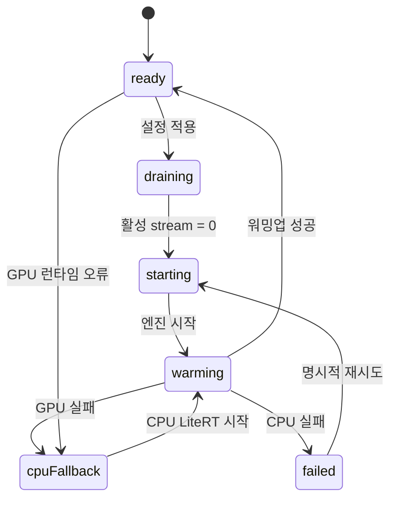

# 체셔 GPU 런타임 아키텍처 설계

- 작성일: 2026-09-07
- 상태: 구현 전 아키텍처 기준
- 상위 설계: `docs/superpowers/specs/2026-09-07-cheshire-gpu-acceleration-design.md`
- 기준 변경: PR #326, `2978d02adcf41f815ba20f6487da0705f15a3c6a`

## 1. 목적과 범위

체셔가 로컬 CPU 또는 GPU 추론 엔진을 안전하게 선택하고, 장치 전환 중에도 기존 Unity 대화 계약을 유지하게 한다.

이번 구조의 목적은 다음과 같다.

- Unity가 로컬 프로세스를 시작하거나 종료하지 않는다.
- FastAPI가 현재 준비된 추론 엔진을 단일 진입점으로 제공한다.
- GPU 오류는 로컬 CPU로 한 번만 복구한다.
- 사용자가 요청한 모드와 실제 사용 중인 장치를 분리한다.
- 외부에서 시작된 기존 LiteRT 서버는 종료하거나 설정을 바꾸지 않는다.

다음은 범위에서 제외한다.

- Unity 설정창과 GPU 부담 UI 구현
- GPU 사용률 백분율 제어
- CPU 경로를 API급 응답 시간으로 만드는 최적화
- 검증 전 CUDA 모델·런타임·다운로드 URL을 고정하는 작업

## 2. 시스템 경계

```mermaid
flowchart LR
    Unity[Unity 체셔]\n/Chat stream SSE/ --> Backend[FastAPI :8000]

    Backend --> Admission[Chat Admission Gate]
    Admission --> Service[ChatService]
    Service --> Manager[LocalRuntimeManager]

    Manager -->|CPU| LiteRT[LiteRTProvider\nLiteRT-LM :9379]
    Manager -->|GPU, Gate 0 통과| LiteRTGpu[LiteRT GPU :9379]
    Manager -->|GPU, Gate 0 실패| Cuda[CudaCompatProvider\nCUDA sidecar :9380]

    Manager --> State[(게임 전용\nsettings.json)]
    Manager --> Probe[Warmup / Benchmark]
    Probe --> Status[/local-ai/status/]
```

Unity는 `/chat`, `/chat/stream`, `/tutor/grade`만 계속 사용한다. `/local-ai/*`는 로컬 운영·설정 계층이며, Unity의 기존 대화 경로를 대체하지 않는다.

## 3. 구성 요소와 책임

| 구성 요소 | 책임 | 금지 사항 |
|---|---|---|
| Unity 체셔 | SSE 표시, 기존 입력·대화 흐름 | 추론 서버 프로세스 제어 |
| Chat Admission Gate | 전환 중 새 채팅을 재시도 가능한 `503`으로 거절 | 요청 본문 수신·인증 전 엔진 잠금 |
| ChatService | 프롬프트 구성, 도구 정책, 응답 정제, SSE 변환 | 장치·포트·프로세스 소유 판단 |
| LocalRuntimeManager | 선택 저장, 엔진 선택, 전환 잠금, 워밍업, CPU 복구, 상태 | 외부 프로세스 종료 |
| RuntimeDriver | 신뢰된 인자 배열로 소유 프로세스 시작·종료, 포트·로그 확인 | 사용자 입력을 셸 명령으로 실행 |
| LiteRTProvider | 기존 `.litertlm` CPU 경로 | GPU 성공을 설정값만으로 선언 |
| CudaCompatProvider | 검증 후 핀한 CUDA OpenAI 호환 서버의 스트림을 `SSEEvent`로 변환 | Unity 전용 API 형식 요구 |
| Control API | 상태 조회, 장치 요청, 벤치마크 | 원격 요청·브라우저 origin·임의 명령 수신 |

`ChatService`는 특정 provider 인스턴스를 영구 보관하지 않는다. 요청을 시작할 때 `LocalRuntimeManager.acquire_provider()`로 준비된 provider lease를 받고, 스트림 완료까지 lease를 유지한다. 이것이 장치 전환과 진행 중 SSE 응답의 경쟁을 막는 경계다.

## 4. 런타임 선택 규칙

```text
requested_mode = cpu
  → LiteRT CPU

requested_mode = auto
  → 검증된 NVIDIA GPU 가능 + 실패 기록 없음: GPU 후보
  → 그 외: LiteRT CPU

requested_mode = gpu
  → GPU 후보를 명시적으로 재시도

GPU 후보
  → Gate 0을 통과한 LiteRT GPU
  → Gate 0 실패 후 검증·핀한 CUDA sidecar
  → 둘 다 없거나 실패: LiteRT CPU
```

`auto`는 벤치마크로 가장 빠른 장치를 고르는 기능이 아니다. 지원·검증된 GPU가 가능하면 GPU를 선택하고, 그렇지 않으면 CPU를 선택하는 정책이다.

CUDA sidecar는 Gate 0 실패 뒤에만 도입한다. 모델 파일, 런타임 버전, 라이선스, 체크섬, 다운로드 용량, 품질 평가 결과가 manifest에 고정되기 전에는 선택 대상이 될 수 없다.

## 5. 상태 모델

| 상태 | 의미 | 새 채팅 |
|---|---|---|
| `stopped` | 관리 런타임을 아직 시작하지 않음 | 기존 외부 경로가 없으면 거절 |
| `ready` | 워밍업을 통과한 소유 엔진이 있음 | 허용 |
| `draining` | 기존 스트림 종료 대기 | `503`, `Retry-After` |
| `starting` | 이전 엔진을 내린 뒤 새 프로세스 시작 | `503` |
| `warming` | 고정 샘플로 실제 추론 확인 | `503` |
| `failed` | CPU까지 초기화 또는 추론에 실패 | `503` |
| `externally_managed` | 포트의 외부 엔진을 감지함 | 기존 체셔 요청은 health 확인 후 허용, 장치 전환은 `409` |

상태 응답에는 아래 값을 함께 제공한다.

```json
{
  "requested_mode": "gpu",
  "configured_backend": "cpu",
  "effective_backend": "unknown",
  "state": "ready",
  "inference_ready": true,
  "managed": true,
  "fallback_reason": "gpu_initialization_failed"
}
```

- `requested_mode`: 사용자가 저장한 `auto`, `cpu`, `gpu`
- `configured_backend`: 엔진 시작에 전달한 값
- `effective_backend`: 초기화 로그·런타임 결과로 확인한 `cpu`, `gpu`, `unknown`
- `inference_ready`: 모델 목록이 아니라 워밍업 추론까지 성공한 상태

GPU 설정 파일이나 GPU 가속기 등록 로그만으로 `effective_backend = gpu`를 기록하지 않는다. 실제 decode 노드가 GPU delegate에 올라가고 GPU 어댑터가 확인된 경우처럼, 고정 런타임에서 검증한 증거가 필요하다.

## 6. 장치 전환 프로토콜



1. 설정 요청을 검증하고 사용자 모드를 원자적으로 저장한다.
2. 관리자는 즉시 `draining`으로 전환한다. 이 시점부터 새 체셔 요청은 받지 않는다.
3. 이미 시작한 스트림은 제한시간까지 완료시킨다. 제한시간 초과는 기존 오류 계약으로 종료한다.
4. 관리자가 소유한 이전 엔진만 종료하고 자원 해제를 기다린다.
5. 목표 장치의 엔진을 시작하고 고정 워밍업 요청을 실행한다.
6. GPU 시작·워밍업 실패 시 CPU LiteRT를 한 번만 시작한다.
7. CPU도 실패하면 `failed` 상태로 남기며 무한 재시작하지 않는다.

GPU 엔진이 유휴 상태에서 종료되면 상태 조회 또는 백그라운드 감시가 이를 감지하고 CPU 복구를 예약한다. 체셔 요청이 오기를 기다려 복구를 시작하면 Unity readiness가 요청을 막아 영구 실패로 남을 수 있다.

## 7. 동시성 및 요청 생명주기

`LocalRuntimeManager`는 두 개의 논리적 잠금을 가진다.

- `transition_lock`: 장치 전환 작업을 하나만 허용한다.
- `inference_lease`: 추론 provider를 사용하는 스트림 수를 추적한다.

장치 전환은 `draining` 상태에서 새 lease를 거절하고, 활성 lease 수가 0이 된 뒤에만 프로세스를 교체한다. SSE 응답이 끝나거나 클라이언트 연결이 끊길 때 lease를 반드시 반납한다.

Admission Gate는 인증과 JSON 본문 검증을 마친 뒤에만 lease를 얻는다. 느리거나 인증되지 않은 HTTP 요청이 엔진 lease를 점유하거나 추론 타임아웃으로 오인되어 CPU 엔진을 실패 처리해서는 안 된다.

## 8. 저장과 프로세스 소유권

게임 전용 상태 경로:

```text
%LOCALAPPDATA%/Disputatio/local-ai/settings.json
%LOCALAPPDATA%/Disputatio/local-ai/runtime-config.json
%LOCALAPPDATA%/Disputatio/local-ai/runtime.log
```

`settings.json`은 `mode`, 후속 GPU 오프로드 단계, 런타임·모델 식별값을 저장한다. 쓰기는 임시 파일 후 원자적 rename으로 수행한다. 잘못된 파일은 CPU 기본값으로 복구한다.

관리자는 자신이 시작한 PID와 프로세스 그룹만 종료한다. 시작 전에 포트가 점유되어 있으면 해당 프로세스는 외부 관리로 본다. 외부 프로세스의 경우 기존 `/chat/stream` 준비 상태를 별도로 확인하고, 대화는 가능하게 유지하되 장치 전환·프로세스 종료·공용 설정 변경을 거절한다.

LiteRT는 `%USERPROFILE%/.litert-lm/config.json`을 수정하지 않는다. 게임 전용 config를 `--config`로 전달한다.

## 9. API 계약

| API | 인증 | 동작 |
|---|---|---|
| `GET /local-ai/status` | loopback + 세션 토큰 | 실행 상태와 실제 장치 조회 |
| `PUT /local-ai/settings` | loopback + 세션 토큰 | 모드 저장·비동기 전환 시작, `202` + `operation_id` |
| `POST /local-ai/benchmark` | loopback + 세션 토큰 | 유휴 `ready` 상태에서만 고정 샘플 측정 |
| `/chat`, `/chat/stream` | 기존 채팅 인증 | 기존 응답 계약 유지, 전환 중 `503` |

제어 API는 loopback IP, 비어 있지 않은 bearer 토큰, origin 부재를 모두 요구한다. 토큰은 시작 스크립트가 생성해 현재 로컬 프로세스에만 전달하며, CLI 인자·URL·로그에 넣지 않는다.

벤치마크는 실제 게임 대화와 분리한다. 고정 샘플, 도구 미사용, 기록 미저장으로 실행하고 TTFT·완료 시간·가능한 경우 tokens/sec만 반환한다.

## 10. 배포 단계

### Gate 0: LiteRT GPU 검증

- 고정 `litert-lm==0.16.1`, 기존 `gemma4-e2b`, 게임 전용 config로 실행한다.
- NVIDIA 4GB, 6GB, 8GB급에서 실제 장치 증거와 워밍업 후 TTFT·완료 시간을 기록한다.
- 품질·프레임·CPU 복구를 포함한 기존 체셔 평가를 통과한다.

통과하면 GPU provider는 LiteRT 기반으로 유지한다.

### Gate 1: CUDA sidecar 도입

Gate 0이 목표를 충족하지 못할 때만 실행한다.

- 하나의 OpenAI 호환 CUDA 서버와 하나의 모델 아티팩트를 선택한다.
- manifest에 버전, 저장소, 파일명, SHA-256, 용량, 라이선스를 고정한다.
- 다운로드 동의를 다시 받고, CPU LiteRT와 CUDA GPU를 동시에 적재하지 않는다.
- 50개 체셔 대화 품질 게이트와 CPU/GPU 성능·프레임 평가를 다시 수행한다.

## 11. 검증 기준

- CPU 모드는 GPU 런타임·CUDA sidecar를 시작하지 않는다.
- GPU 성공은 실제 장치 증거, 상태 API, 벤치마크 결과가 일치한다.
- GPU 시작·워밍업·추론 실패는 한 번의 CPU 복구로 끝난다.
- 전환 중 연속 적용·새 채팅·연결 해제에 엔진이 중복 실행되지 않는다.
- 외부 LiteRT 서버는 종료·변경되지 않고 정상 대화를 계속할 수 있다.
- 느린 인증되지 않은 요청은 추론 lease나 엔진 상태에 영향을 주지 않는다.
- 유휴 GPU 프로세스 종료는 health polling만으로 CPU 복구가 시작된다.
- `/chat`, `/chat/stream`, `/tutor/grade`, SSE 이벤트 스키마가 기존 테스트와 호환된다.

성능 판정은 Unity 첫 글자 표시 시간, 백엔드 TTFT, 완료 시간, 게임 프레임 시간, VRAM 사용량을 함께 기록한다. 콜드 로딩 시간은 워밍업 뒤 대화 SLO와 분리한다.
