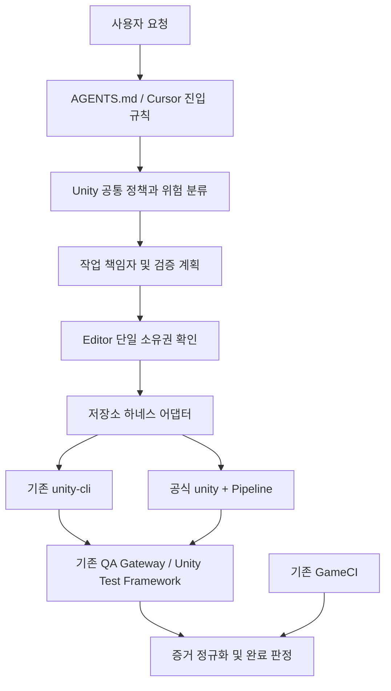

# Unity 전용 에이전트 하네스 및 공식 CLI 전환 설계

작성일: 2026-09-10
개정: 2026-09-10 — 기준 스펙 고정, 이탈 처리, 스크립트 추가 조건, 저장 결과 검증 보강.
상태: 검토용 설계안. 현재 운영 규칙을 변경하거나 CLI 전환을 실행한 문서가 아니다.
설계 책임자: 현재 요청을 수행하는 부모 에이전트(feature-coordinator).
범위: Unity 작업 규칙, 검증 계약, Editor 소유권, CLI 연결, 기존 QA 및 CI 연동.

## 1. 목표와 대전제

> 에이전트는 사용자 요청과 기준 스펙의 요구사항을 작업 계약으로 고정하고, 대상 Unity 프로젝트와 Editor 상태를 확인한다. 기존 에셋·참조·사용자 변경을 보존하며 기존 구조로 충족할 수 있는 작업은 해당 구조에서 해결한다. Editor 조작은 단일 담당자가 수행한다. 자동화 수단과 최종 게임 구조를 구분하고, 저장된 결과와 실제 동작을 요구사항별 증거로 검증한다. 실행 도구가 달라도 완료 기준을 유지한다.

성공 조건:

- Cursor와 다른 실행기가 동일 변경에 동일한 필수 검증을 선택한다.
- 모든 요구사항이 기준 스펙의 위치, 변경 대상, 검증 증거에 연결되고 임의로 누락·대체되지 않는다.
- Inspector·에셋 수정으로 충분한 작업에 불필요한 런타임 스크립트를 추가하지 않는다.
- 문서 수정, 순수 로직, 씬/UI, 저장·전환 변경을 구분한다.
- CLI 통신 성공, 컴파일 성공, 테스트 성공, 게임 동작 성공을 구분한다.
- 현재 QA의 저장 격리·단일 playtester·취소·복구 계약을 보존한다.
- 공식 CLI의 호환성 증거가 확보된 뒤 기본 실행 경로를 전환한다.

제외 범위: 게임 기능 수정, Unity 버전 업그레이드, 백엔드 재설계, 배포 정책 개편, 새로운 상주 에이전트 플랫폼. 문서 작성이나 설계 승인만으로 설치·커밋·push·배포가 승인되는 것은 아니다.

## 2. 확인된 현재 상태

| 항목 | 확인 결과 | 저장소 근거 |
|---|---|---|
| Unity 프로젝트 | `disputatio/`, `6000.0.36f1` | `disputatio/ProjectSettings/ProjectVersion.txt` |
| 실행 래퍼 | `%LOCALAPPDATA%\\unity-cli\\unity-cli.exe` 호출 | `scripts/unity-cli.cmd`, `scripts/unity-cli.ps1` |
| 커넥터 | `com.youngwoocho02.unity-cli-connector` | `disputatio/Packages/manifest.json` |
| 의존성 고정 상태 | manifest URL에는 태그 없음. lock에는 `c07b5dbd71edb51810df1a678d565bc045d5046e` 기록 | `disputatio/Packages/packages-lock.json` |
| 로컬 캐시 | 커넥터 package.json 버전 `0.3.21` | `disputatio/Library/PackageCache/com.youngwoocho02.unity-cli-connector@6be123977e70/package.json` |
| QA 연결 | `UnityCliConnector` 및 `[UnityCliTool]` 사용 | `disputatio/Assets/Editor/QA/QaUnityCliTools.cs` |
| 로컬 검증 규칙 | `.harness`와 Cursor 규칙·스킬에 분산 | `.harness/unity-cli-postflight.md`, `.cursor/rules/unity-verification-postflight.mdc` |
| CI | GameCI 기반 EditMode·PlayMode 및 빌드 워크플로 존재 | `.github/workflows/unity-client-build.yml` |

캐시 버전은 실행 파일 버전을 증명하지 않는다. 실행 파일 버전, 현재 Editor 연결 상태, CI 최근 성공 여부는 이 설계에서 미검증이다. 기존 미커밋 사용자 변경과 미추적 문서는 실행 단계에서 다시 확인하고 보존한다.

현재 CLI는 개인 오픈소스 `youngwoocho02/unity-cli`다. Unity 공식 CLI는 `unity` 실행 파일과 `com.unity.pipeline`을 사용하며, 현재 공식 문서에는 experimental로 표시된다. 공식 Pipeline의 문서상 최소 Editor 버전은 6.0이다. 현재 프로젝트는 최소 버전 조건을 충족하지만 실제 패키지 호환성을 보장하지 않는다.

## 3. 대안과 선택

| 대안 | 장점 | 비용·제한 | 판정 |
|---|---|---|---|
| 기존 CLI만 유지하고 규칙 정리 | QA 수정 범위가 작음 | 공식 도구와의 명령·유지보수 차이가 계속 남음 | 1단계 기준선으로 사용 |
| 공식 CLI로 즉시 교체 | 도구 체계가 빨리 통일됨 | QA 사용자 정의 명령과 복구 흐름이 깨질 수 있음 | 채택하지 않음 |
| 공통 계약 + 기존 경로 유지 + 공식 경로 검증 후 전환 | 비교·복귀 가능, 규칙과 실행 도구 분리 | 제한된 어댑터 및 비교 검증 필요 | 권장안 |

공식 CLI를 최종 기본 경로 후보로 삼되, 필수 기능 중 하나라도 충족하지 못하면 기존 경로를 유지한다. 공식이라는 이유만으로 완료 기준을 낮추지 않는다.

## 4. 목표 구조

두 CLI는 동시에 같은 Editor를 변경하지 않는다. 도식의 두 경로는 선택 가능한 대안이다. CI는 별도 실행 환경에서 같은 완료 계약을 따르며 로컬 CLI를 반드시 거칠 필요는 없다.

### 4.1 문서 책임과 적용 우선순위

플랫폼의 상위 지침 및 사용자 요청을 우선한다. 저장소 내부에서는 공통 정책, 영역별 정책, 실행기별 수행 방법을 구분한다. 영역별 추가 요구는 공통 완료 기준을 약화하지 않는다. 충돌 시 실제 동작과 문서 근거를 기록하고 필요한 좁은 결정을 요청하며, 무관한 작업은 계속한다.

| 파일 | 목표 책임 |
|---|---|
| `AGENTS.md` | 사용자 변경 보존, 단일 책임자, 작업 분류 진입점. 상세 명령 복제 금지 |
| `.harness/unity-policy.md` (신규) | Unity 대전제, 기준 스펙 고정·이탈 처리, 구현 수단 선택, 위험도, 소유권 |
| `.harness/unity-verification.md` (신규) | 변경별 필수 검증, 증거 형식, 완료 판정 |
| `.harness/unity-toolchain.json` (신규) | 활성 backend, 정확한 CLI·커넥터 버전, 지원 capability, 검증 시점 |
| `.harness/unity-cli-postflight.md` | 기존 참조를 유지하는 짧은 안내. 공통 검증 문서로 연결 |
| `.cursor/rules/unity-verification-postflight.mdc` | Unity 파일 변경 시 공통 문서를 읽게 하는 진입 규칙 |
| `.cursor/rules/architecture-preflight.mdc` | 아키텍처 선독과 함께 작업 기준 스펙 및 요구사항 대응표 확인 |
| `.cursor/skills/newcapstone-unity-automation/SKILL.md` | backend별 사용법과 오류 진단. 완료 기준은 공통 문서 참조 |
| `docs/development/feature-workflow.md` | 위험도별 역할 배정과 리뷰 수준. 작은 작업의 경량 경로 명시 |
| `docs/development/task-packet-template.md` | 기준 스펙 식별값, 요구사항 대응표, 이탈 결정, 스크립트 추가 근거, 위험도·소유권·증거 |

`docs/architecture.md`의 SceneNames, FungusVariableKeys, SceneTransitionService, InteractionInputGate, 저장 키 보존 원칙은 유지한다. Cheshire localization의 더 엄격한 순차 구현·2단계 리뷰도 유지한다.

백엔드, Notion, 배포 규칙은 해당 경계를 실제 변경할 때만 활성화한다. Unity HTTP payload나 저장 schema를 변경하면 Unity 전용 요청이라도 연동 계약 검증을 포함한다.

### 4.2 기준 스펙 고정 및 변경 관리

작업 시작 시 부모가 사용자 요청과 대상 스펙을 실제로 읽고 다음을 작업 패킷에 기록한다. 별도 스펙이 없는 작은 작업은 사용자 요청을 짧은 요구사항으로 기록하며 새 설계 문서를 의무적으로 만들지 않는다.

- 기준 스펙 경로 및 revision 또는 파일 내용 hash. 미커밋 문서도 내용 기준으로 식별한다.
- 이번 작업에 적용할 절과 요구사항 ID, 제외 범위, 유지해야 할 구조·연결·시각적 조건.
- 참고 문서와 구현 계획의 역할. 구현 계획은 기준 스펙을 임의로 완화할 수 없다.
- 스펙 이후 사용자가 제공한 수정 지시와 그것이 대체하는 요구사항.

요구사항 대응표는 `요구사항 ID / 출처 절 / 기대 결과 / 변경 대상 / 검증 방법 / 증거 / 판정`을 사용한다. 모든 구현자와 리뷰어에게 같은 기준을 전달하고, 새 파일·컴포넌트는 어느 요구사항을 충족하는지 설명할 수 있어야 한다. 위임 또는 세션 재개 시 식별값이 달라졌다면 영향받는 요구사항·계획·증거만 재조정한다.

| 상황 | 처리 |
|---|---|
| 명세를 유지하는 내부 함수 분리·도구 선택 | 담당자가 판단하고 진행. 불필요한 승인 요청 없음 |
| 사용자가 이미 요구사항·구조 변경을 지시함 | 해당 지시를 근거로 기준 갱신 후 진행. 재승인 요청 없음 |
| 요구 동작·레이아웃·저장 위치·구조·범위를 바꿔야 함 | 기존 요구, 제안 차이, 이유, 영향, 대안을 제시하고 사용자 결정 전 해당 변경 보류 |
| 도구 실패로 요구사항을 실행할 수 없음 | 같은 계약을 충족하는 검증된 경로를 찾고, 없으면 해당 항목 blocked. 코드 우회로 요구사항 대체 금지 |
| 문서와 코드가 서로 다름 | 차이를 기록하고 이번 작업의 기준으로 판단. 기존 구현을 자동 정답으로 삼지 않음 |

스펙과 다른 구현이 먼저 만들어졌다면 구현을 정당화하려고 스펙을 사후 수정하지 않는다. 승인된 요구로 되돌리거나 차이를 제시해 결정을 받는다. 보류가 필요한 경우에도 독립적으로 진행 가능한 작업은 계속한다.

### 4.3 기존 Unity 구조와 스크립트 추가 조건

작업 전에 대상 오브젝트·기존 컴포넌트·직렬화 값·Prefab override·이벤트 연결을 조사한다. CLI/MCP는 조작 경로이며, 해당 경로를 쓰는 것이 새 게임 스크립트를 추가할 근거는 아니다.

선택 순서:

1. 기존 Inspector 값, 에셋, 이벤트 참조, 컴포넌트 설정으로 요구를 충족할 수 있으면 그 상태를 수정한다.
2. 기존 컴포넌트에 해당 책임이 있고 동작 변경이 필요하면 그 구현을 확장한다.
3. 반복·일괄 에셋 편집이 필요하면 Editor 전용 자동화를 사용한다. 적용 대상과 저장 결과를 검토할 수 있어야 한다.
4. 기존 구조에 없는 런타임 동작이 요구될 때 새 런타임 스크립트를 추가한다.

새 런타임 스크립트에는 연결된 요구사항 ID, 기존 구조로 충족할 수 없는 이유, 책임·수명 주기, 부착 대상, 상태의 기준 소유자를 기록한다. 같은 책임의 Manager·상태·이벤트 경로를 중복 생성하지 않는다. 이 근거 기록은 모든 코드 추가에 사용자 승인을 요구하는 절차가 아니다. 명시된 구조나 사용자 관찰 동작을 바꿀 때만 §4.2의 변경 결정을 적용한다.

| 구분 | 허용 목적 | 검증·정리 |
|---|---|---|
| 일회성 Editor 자동화 | 기존 씬·프리팹 값과 연결을 수정·저장 | 재실행 시 중복 생성 없음, 대상 한정 저장, 재로드 확인. 이번 작업에서 만든 임시 코드만 제거하거나 유지 이유 기록 |
| 유지할 Editor 도구 | 반복 마이그레이션·제작 워크플로 | Editor 전용 경계, 적용 범위와 사용법, 재실행 안전성 검증 |
| 런타임 게임 코드 | 스펙에 필요한 실행 중 동작 | 기존 책임과의 관계, 정상 시작·재진입·종료 동작 검증 |

금지 사례: 버튼 Inspector 참조 수정 대신 매 실행마다 Find/AddComponent로 보정하는 코드를 추가하는 것, 고정 UI 배치 요구를 Update에서 덮어쓰는 것, 씬 저장 누락을 자동 초기화로 숨기는 것. 런타임 생성·반응형 배치·동적 연결이 실제 요구사항인 경우에는 그 요구를 근거로 구현할 수 있다.

예: 기존 버튼의 OnClick 연결 수정 요청은 해당 연결을 저장하고 씬 재로드 후 클릭으로 검증한다. 연결을 매번 복구하는 MonoBehaviour 추가로 대체하지 않는다.

## 5. 작업 분류와 역할

| 등급 | 예 | 검증 및 리뷰 |
|---|---|---|
| R0 | 설명 문서, 동작에 영향 없는 주석 | diff·경로·규칙 정합 자체 검토. Unity 실행 불필요 |
| R1 | 독립 계산, 좁은 로직 버그, 단일 컴포넌트 | 재현/실패 조건, 컴파일, 관련 테스트. 명세·품질 체크를 한 명이 순차 수행 가능 |
| R2 | 씬·프리팹·UI 입력, 컴포넌트 수명 주기 | 컴파일(해당 시), 참조 확인, 실제 PlayMode/플레이 검증, 별도 세션의 명세·품질 검토 |
| R3 | 저장·씬 전환·공유 상태·패키지·하네스 변경 | R2 + 경계 회귀·복구 검증. 명세 통과 후 별도 품질 리뷰 수행 |

R0/R1의 자체 검토는 `independentReview: false`로 기록하되 승인된 경량 정책을 충족하면 완료 가능하다. R2/R3에서 필수 독립 리뷰가 불가하면 리뷰는 blocked이며 전체 verified가 아니다. 위험도는 파일 확장자만으로 판단하지 않는다. 공유 상태 영향이 발견되면 상향한다.

부모가 최종 판정과 작업별 단일 책임자를 기록한다. 독립적으로 검증 가능한 조사·리뷰는 위임 가능하다. 같은 checkout의 구현은 순차 실행하고, 별도 checkout에서도 Editor 조작자는 한 명이다. 모델 선택 정보는 실제 도구 지원을 기록하며, 매번 모든 공급자를 조사하지 않고 환경 변경 또는 재배정 시 갱신한다.

## 6. 검증 매트릭스

| 변경 | 필수 증거 | 추가 조건 |
|---|---|---|
| C# 동작 | 실제 Unity 컴파일, 관련 테스트 결과, 새 관련 Console 오류 유무 | 수명 주기·입력 동작이면 PlayMode 추가 |
| 씬·프리팹·Inspector | 대상 에셋 로드, 누락 스크립트/참조 검사, 의도한 값·연결 확인 | 직접 직렬화 수정 시 대상만 재직렬화; 게임 흐름 변경은 플레이 QA |
| UI 배치·표시 | 지정 해상도·상태의 화면 증거, 잘림·겹침 확인 | 클릭/포커스 변경은 입력 검증; 의미 없는 EditMode 테스트 추가 금지 |
| 저장·씬 전환 | 새 시작·재진입·로드·설정 보존 시나리오 | 정상 플레이어 저장을 사용하지 않고 QA 격리 프로파일 사용 |
| 공유 Interaction | 영향받는 컨트롤러 회귀 및 전환·입력 잠금 확인 | 기존 8개 스위트 매핑을 초기 기준으로 보존하고 의존성 증거로 조정 |
| 패키지·CLI | 버전·연결·컴파일·테스트·QA 명령·취소·복구 | 프로젝트 재열기 또는 domain reload 후 재연결 확인 |
| Player 전용 조건부 코드·빌드 설정 | 대상 Player 빌드 결과 | Editor 통과로 Player 성공을 대신하지 않음 |

테스트 필터는 설치된 backend 버전의 의미를 확인한다. 매칭된 테스트 수가 0이면 검증 성공이 아니다. Console은 시작 시점 대비 새 관련 오류를 구분하고 원본 로그를 보존한다. 테스트 기대값을 낮추거나 재시도로 실패를 숨기지 않는다.

기존 실패는 baseline에 기록한다. 필수 대상 테스트가 기존부터 실패한 경우 해당 검증은 fail/blocked로 남기고 전체 verified를 주장하지 않는다. 무관한 기존 실패는 별도 제한으로 보고한다.

### 6.1 저장된 결과와 실제 동작 검증

씬·프리팹·Inspector·UI 작업의 완료는 유틸리티 생성, 명령 성공 또는 컴파일 성공으로 판정하지 않는다.

1. 요구사항 대응표의 대상 오브젝트·컴포넌트·참조·값을 실제 변경 결과와 대조한다. Prefab asset과 scene instance 중 어느 쪽에 저장할 것인지 기준을 명시하고 override를 확인한다.
2. 이번 작업 대상만 저장하고 에셋 diff를 확인한다. 사용자의 다른 dirty scene을 일괄 저장하거나 버리지 않는다.
3. 저장 안전성을 확보한 뒤 대상 씬·프리팹을 재로드해 값·연결이 유지되는지 확인한다. 다른 사용자 작업 때문에 재로드 불가하면 해당 검증을 blocked로 남긴다.
4. 요구에 맞는 PlayMode 입력·상태 전환과 UI 화면 증거를 확인한다. UI의 해상도·비교 상태는 기준 스펙 또는 작업 계약에 명시한다.
5. 일회성 Editor 자동화를 다시 실행하지 않은 상태에서도 저장된 결과로 정상 동작하는지 확인한다. 런타임 생성 자체가 요구인 경우에는 그 정상 시작 경로를 검증한다.

스크린샷만으로 참조 저장을 증명하거나, 직렬화 값만으로 클릭·표시 동작을 증명하지 않는다. 각 요구사항에 필요한 증거를 연결한다.

## 7. Editor 소유권과 복구

1. 변경 전 projectPath, Editor PID, compilation/play 상태, dirty scene, QA run/lease를 확인한다.
2. 통합 담당자가 일반 Editor 조작을 소유한다. QA 시작 시 새 Editor 변경 명령을 멈추고 playtester에게 소유권을 인계한다.
3. playtester는 기존 QA gateway를 통해 lease를 획득하고 heartbeat를 유지한다.
4. 성공·실패·취소 시 증거를 저장하고 프로파일 복원·lease 해제를 확인한다.
5. 통합 담당자는 복원 증거를 확인한 뒤 소유권을 돌려받는다.

문서상의 소유권 기록은 실제 잠금 구현을 뜻하지 않는다. 기존 QA lease가 보호하는 범위와 일반 Editor 명령의 미보호 범위를 구분하고, 모든 에이전트 경로가 공통 소유권 확인을 거치게 한다. 외부 수동 조작까지 완전히 차단한다고 주장하지 않는다.

연결 timeout은 재시작 허가가 아니다. 먼저 기존 명령의 실행 상태를 조회한다. mutation 결과가 불명확하면 같은 명령을 재전송하지 않는다. 프로세스 종료·재시작 또는 stale lease 회수는 소유자, 실행 중 작업, 미저장 상태를 확인한 복구 절차로만 수행한다. 기존 `qa_recover`의 실제 조건을 검증한 뒤 사용한다.

## 8. 하네스와 CLI 어댑터 계약

목표 파일은 `scripts/unity-harness.ps1`, `scripts/unity-harness/legacy.ps1`, `scripts/unity-harness/official.ps1`이다. 이는 새로 구현할 저장소 인터페이스이며 현재 실행 가능한 명령이 아니다.

공통 작업 집합:

| operation | 입력 | 완료 조건 |
|---|---|---|
| `probe` | projectPath | 정확한 프로젝트, backend/connector 버전, 상태와 capability 반환 |
| `compile` | projectPath, timeout | 컴파일 종료와 오류 결과 확인 |
| `console` | projectPath, 시작 기준점 | 기준점 이후 로그와 원본 위치 반환 |
| `test` | mode, filter, timeout | 매칭/실행/pass/fail/skip 수와 결과 파일 반환 |
| `qa` | action, scenarioId/runId, ownerId | 기존 QA gateway 호출; start/status/cancel/capture/recover 구분 |

CLI 고유 명령·옵션은 어댑터 내부에 둔다. 임의 C# eval을 자동 fallback으로 사용하지 않는다. 프로젝트 에셋 변경 수단은 §4.3에 따라 선택하며 기존 도구로 충분하면 새 유틸리티를 만들지 않는다. Editor 유틸리티를 쓰더라도 §6.1의 저장 결과 검증을 충족해야 한다.

공통 결과 필드: `schemaVersion`, `operation`, `backend`, `toolVersion`, `connectorVersion`, `projectPath`, `editorPid`, `startedAt`, `finishedAt`, `executionStatus`, `verificationStatus`, `nativeExitCode`, `artifacts`, `errorCategory`.

- executionStatus: `succeeded`, `failed`, `timed-out`, `cancelled`, `blocked`.
- verificationStatus: `passed`, `failed`, `blocked`, `not-applicable`, `waived`.
- errorCategory: `none`, `tool-missing`, `version-mismatch`, `editor-unavailable`, `compilation`, `test-failure`, `ownership`, `timeout`, `invalid-input`.
- 테스트 결과에는 `matched`, `executed`, `passed`, `failed`, `skipped`를 추가한다. backend가 매칭 수를 제공하지 않으면 unknown으로 남기고 실제 실행 수가 양수인지 검증한다.
- CLI exit code 0만으로 verificationStatus를 passed로 변환하지 않는다.

backend 선택은 toolchain 설정에 명시한다. 테스트 실패를 다른 backend의 성공으로 덮지 않는다. 연결 전 실패에 한해 호환성이 검증된 대체 경로를 선택하고 선택 사실을 기록할 수 있다. mutation 시작 뒤에는 결과와 소유권을 정리하기 전 경로를 바꾸지 않는다.

정확한 공식 CLI 옵션·Pipeline 패키지 버전은 호환성 조사 단계에서 설치 버전의 help와 command schema로 확정한다. 확인되지 않은 명령을 설계에 실행 코드로 넣지 않는다.

## 9. QA 이식 경계

기존 `QaUnityCliTools.cs`는 현재 커넥터용 진입점으로 유지한다. 공식 CLI용 진입점은 `disputatio/Assets/Editor/QA/QaOfficialCliCommands.cs`로 분리하는 안을 사용한다. 공식 패키지 API 확인 후 컴파일 의존성을 분리하고, 공통 QA 실행 코어는 기존 gateway를 재사용한다.

대응 대상은 `qa_status`, `qa_list`, `qa_run`, `qa_cancel`, `qa_capture`, `qa_recover`다. 명령명 일치보다 다음 계약을 우선한다:

- 동일 시나리오 ID와 run ID, 같은 assertion 및 evidenceRoot.
- 중복 시작 거부, run 상태 조회, 취소 완료 확인.
- QA 프로파일 격리 및 복원, lease owner 검증.
- domain reload·연결 끊김 뒤 실행 중 상태 복원.
- 구현체별 transport 결과를 동일 증거 형식으로 변환.

두 connector의 동시 설치 가능 여부는 미검증이다. 최초 공식 실험은 별도 checkout/Editor로 수행하고 동시 설치를 전제로 삼지 않는다. 삭제에 앞서 기존 `[UnityCliTool]` 참조와 assembly 의존성이 남아 있는지 검사한다.

## 10. 증거와 최종 상태

기존 게임 QA 증거는 `docs/qa/runs/`를 유지한다. 일반 하네스 검증은 `.harness/runs/<run-id>/`에 보관하는 안을 사용하며 원본 로그는 기본 커밋 대상에서 제외한다. 기존 작업 패킷이 요약과 증거 위치를 참조한다.

증거에는 프로젝트 절대 경로, base revision, 실제 변경 파일과 diff 식별값, 도구 버전, 명령·exit code, 시작/종료 시각, 테스트 수, 실패·생략 사유를 남긴다. revision이 같아도 미커밋 diff가 달라지면 관련 증거를 재평가한다.

명세 리뷰는 요구사항 대응표의 각 행을 실제 diff·저장된 에셋·동작 증거와 대조한다. 품질 리뷰는 새 스크립트의 필요성, 중복 상태, 런타임 보정으로 가려진 에셋 결함, 임시 코드 잔존을 확인한다. 자체 검토가 허용된 위험도에서도 같은 질문을 사용한다. 구현자 요약이나 테스트 통과만으로 스펙 준수를 추정하지 않는다.

작업 상태와 검증 상태는 분리한다. 작업은 planned/running/review/changes-requested/verified/blocked를 유지한다. 필수 검증이 모두 passed 또는 근거 있는 not-applicable이고 해당 위험도의 리뷰가 충족돼야 verified다. 사용자 요청으로 생략한 검사는 waived이며 전체 verified로 표시하지 않고 '구현 반영, 검증 일부 생략'으로 보고한다.

## 11. 단계별 전환과 종료 조건

| 단계 | 단일 책임 역할 | 산출물·대상 | 다음 단계 진입 조건 |
|---|---|---|---|
| A. 정책 통합 | 정책 문서 구현자 | §4 파일, feature workflow·패킷·Cursor 진입점 정리. 스펙 대응표·이탈 처리·스크립트 추가 조건 반영 | R0~R3의 검증 선택 일치 및 §12 AC10~AC14 정책 사례 검토 통과 |
| B. 기존 경로 정규화 | 하네스 구현자 | 공통 래퍼, legacy 어댑터, 결과 계약 | 성공·컴파일 실패·테스트 실패·0개 실행·timeout이 올바르게 구분 |
| C. 공식 CLI 호환성 조사 | Unity 통합 담당자 | 격리 checkout에서 설치 버전·지원 명령·패키지 의존성 기록 | 6000.0.36f1에서 컴파일·연결·기본 테스트 확인; 실패 시 기존 경로 유지 |
| D. 공식 QA 연결 | Unity 통합 담당자 | official 어댑터와 QA 진입점 | 6개 QA 명령 및 저장 격리·취소·복구 검증 |
| E. 동등성 검증 | 단일 QA playtester | 동일 revision·시나리오의 순차 비교 증거 | assertion, 테스트 수, 실패 처리, 프로파일 복원이 모두 충족 |
| F. 기본 경로 전환 | coordinator + 통합 담당자 | toolchain 기본 backend와 문서 갱신 | 명세 리뷰 → 품질 리뷰 → 통합 검증 통과 및 복귀 절차 확인 |

이는 설계 단계의 작업 분해이며 아직 작업자 세션을 배정하거나 실행한 것이 아니다. 실제 구현 시 각 단계의 파일 소유권·세션·모델을 작업 패킷에 기록한다. 같은 checkout의 구현은 순차 수행한다.

전환 후 기존 경로는 복귀 가능한 기간 동안 보존한다. 복귀 시 정상 종료/취소, lease 해제, 프로파일 복원을 먼저 확인하고 backend 설정을 되돌린다. 패키지 복원이 필요하면 이 작업에서 변경한 manifest·lock·어댑터만 복원하며 사용자 변경을 덮는 전체 reset을 사용하지 않는다. 기존 경로 제거는 전환 직후 자동 수행하지 않는다.

## 12. 수용 기준 및 검증 계획

- AC1: 문서/주석 변경은 Unity 실행 없이 검증 종료할 수 있고, R2/R3는 필수 독립 리뷰가 빠지면 verified가 될 수 없다.
- AC2: 잘못된 프로젝트 경로 또는 다른 owner의 lease가 있으면 mutation 전에 거부한다.
- AC3: 컴파일 실패, 테스트 실제 실패, 테스트 0개 실행, 연결 timeout을 각각 다른 결과로 기록한다.
- AC4: PlayMode/QA 취소 후 이전 프로파일 복원과 lease 해제를 증거로 확인한다.
- AC5: 공식 경로와 기존 경로에서 같은 QA 시나리오와 assertion 결과를 비교할 수 있다.
- AC6: 실행 중 연결 끊김 때 중복 mutation을 보내지 않고 상태 확인 또는 blocked로 종료한다.
- AC7: 필수 검증 생략·도구 불가·기존 실패가 통과로 바뀌지 않는다.
- AC8: 전환 후 실패를 유도한 복귀 연습에서 사용자 변경과 정상 저장을 보존한다.
- AC9: 정책과 Cursor 진입점의 링크, 필수 필드, 기존 커넥터 의존성 잔존 여부를 정적 점검한다.
- AC10: 스펙이 제공된 작업은 기준 문서 식별값과 요구사항 대응표가 있으며, 누락된 요구를 둔 상태에서 verified가 될 수 없다.
- AC11: 명시된 구조 변경이 필요한 사례에서 차이와 결정 근거가 기록되고, 사용자 결정 전 의존 변경을 실행하지 않는다. 명세를 유지하는 내부 구현 선택은 자율 진행한다.
- AC12: 버튼 참조·고정 UI 배치 수정 사례에서 기존 에셋을 수정하며 불필요한 런타임 보정 스크립트가 추가되지 않는다. 새 스크립트에는 요구사항과 필요성 근거가 있다.
- AC13: 일회성 Editor 자동화로 바꾼 씬·프리팹은 저장·재로드 후 값과 참조가 유지되고, 자동화 재실행 없이 요구 동작을 확인한다.
- AC14: 명세 리뷰에서 요구사항과 다른 결과를 검출하고, 품질 리뷰에서 불필요한 Manager·상태 중복·임시 코드 잔존을 검출한다.

정책 통합 단계에서는 문서 수정, 버튼 참조 수정, 신규 런타임 동작, 승인 없는 구조 변경 제안, 도구 불가의 사례를 정적으로 검토한다. 이 사례 검토는 정책의 모순·누락을 찾는 검증이며 실제 에이전트 준수나 Unity 동작 성공의 증거가 아니다. 실행 단계에서는 AC10~AC14를 실제 작업 패킷·diff·에셋·리뷰 결과에 적용한다.

구현 단계 검증은 어댑터 단위 fixture 검사, 실제 Editor 통합 검사, 단일 playtester QA, 기존 GameCI 순서로 수행한다. 가짜 결과를 사용하는 어댑터 테스트는 파싱·판정 검증에만 사용하고 실제 Unity 통과 증거로 인정하지 않는다. CI 최근 실행 결과를 확인하기 전 워크플로 파일의 존재만으로 CI 통과를 주장하지 않는다.

## 13. 도입 전 확인해야 할 사실

| 미확인 항목 | 확인 방법 | 실패 시 결정 |
|---|---|---|
| 현재 CLI 실행 파일 버전·커넥터 호환 | 설치 파일 help/version과 실제 probe 대조 | 버전 기준선 확보 전 전환 검증 중단 |
| 공식 Pipeline의 프로젝트 내 컴파일 | 격리 checkout, 현재 Editor 버전으로 compile | Editor 업그레이드를 자동 수행하지 않고 기존 경로 유지 |
| 공식 사용자 정의 명령 API | 설치 패키지 문서·소스·command schema 확인 | QA 이식 단계 진입 보류 |
| 두 connector 동시 설치 | 격리 환경에서 assembly·등록 충돌 확인 | 상호 배타적 패키지 구성으로 검증 |
| 테스트 filter 실제 의미 | 설치 버전에서 클래스·이름·0개 매칭 사례 실행 | 확인된 필터 형식만 capability로 기록 |

## 14. 조사 출처

2026-09-10 대화 조사에서 확인한 문서다. 구현 직전 설치 버전과 문서 변경을 다시 대조한다.

- 기존 도구 및 커넥터: https://github.com/youngwoocho02/unity-cli
- Unity 공식 CLI 소개 및 `com.unity.pipeline`, `[CliCommand]`: https://unity.com/blog/meet-the-unity-cli
- 공식 CLI 명령, experimental 상태, 설치 버전 help 기준: https://docs.unity.com/en-us/unity-cli/unity-cli-reference
- Pipeline 요구 버전 및 연결 절차: https://docs.unity.com/en-us/unity-production-pipeline/local-tools-cli/unity-pipeline-package

설계 자체 점검: 현재 사실과 목표 파일을 구분했고, 공식 CLI 호환성·실행 파일 버전을 미검증으로 표시했다. 이 문서 작성으로 운영 정책·CLI·Unity 에셋은 변경되지 않는다.
