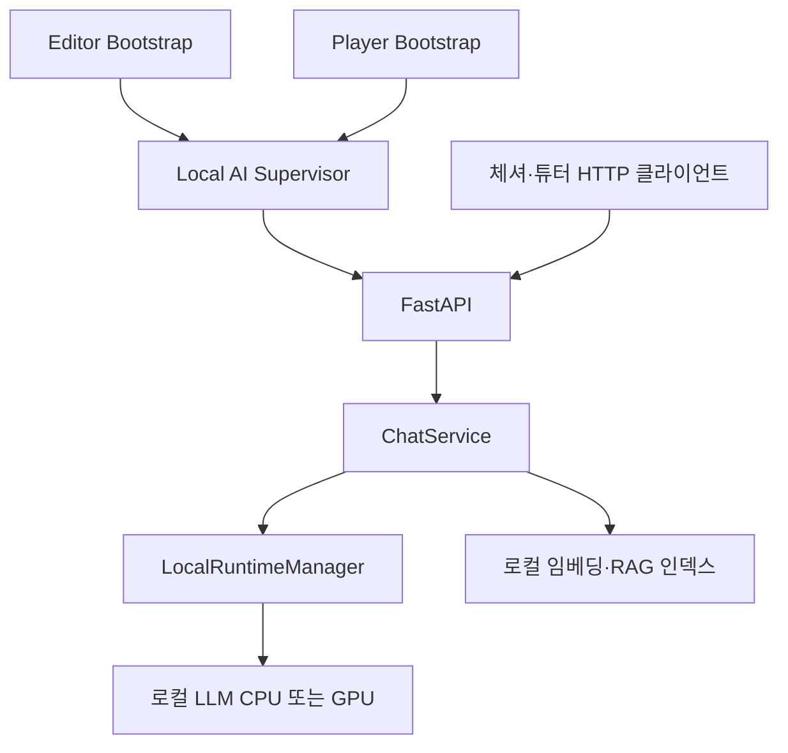

# 로컬 LLM 기본화 및 Editor·Windows Player 자동 실행 설계

- 작성일: 2026-09-15
- 상태: 구현 진행 / **기능 미완료** (AC01–AC18 전량 pass 아님, independentReview false)
- 기준 revision: `6266ee443005d7e45a8500695919c16cedc41517` (설계 시점). 2026-09-15 구현 증거: `docs/qa/runs/20260915T014800Z-run-local-llm-autostart-ac/report.md`, Gate 0: `2026-09-15-local-llm-gate0-decision.md`
- 요청: 외부 AI API 코드를 제거하고 로컬 LLM을 기본으로 사용한다. Unity Editor와 Windows 게임 exe 시작 시 로컬 서버를 백그라운드에서 자동 실행한다.
- 이번 산출물: 설계와 완료 기준. 제품 코드 변경, 서버 실행, 모델 설치, 커밋·push·배포는 포함하지 않는다.
- 총괄 및 문서 단일 책임자: 현재 부모 에이전트 `/root` (feature-coordinator).

## 1. 기준과 범위

### 확인한 현재 상태

- `backend_ai/main.py`는 Groq/Gemini provider를 초기화한다. `GET /`의 고정 online 응답은 실제 추론 준비를 증명하지 않는다.
- `services/tutor_rag_service.py`의 검색어 임베딩과 `scripts/build_tutor_rag_index.py`의 인덱스 생성에도 Google API 의존이 있다.
- `BaseChatbot`은 Inspector URL을 우선하고 `ServerConfig`를 fallback으로 사용한다. 튜터 채점에도 별도 URL 처리가 있어 통합해야 한다.
- `providers/base.py`의 `AIProvider.stream_chat()` 및 `models/responses.py`에 기존 대화·SSE 계약이 있다.
- 이전 GPU 문서에 LiteRT/CUDA 설계가 있으나 현재 조사한 체크아웃에서 해당 로컬 추론 구현은 확인하지 못했다. 실제 사용 중인 다른 경로의 서버를 검증한 결과가 아니다.

### 포함 범위

Windows 데스크톱 Editor·Player, 로컬 대화·도구 호출·RAG·채점, 공통 백그라운드 실행기, 준비/복구/종료, 오프라인 배포 패키지, 외부 AI 의존 제거 및 검증.

### 제외 범위

WebGL·모바일·macOS·Linux 지원, Windows 상주 서비스 등록, 클라우드 fallback, 모델 학습, 자동 업데이트, 실행 중 모델 다운로드, 여러 게임 인스턴스 사이 모델 공유, GPU 성능 보장.

기본 모델과 임베딩 모델을 배포에 포함한다. 패키지를 받는 과정과 설치 완료 후 오프라인 실행은 구분한다. 설치된 제품의 AI 기능은 인터넷 및 외부 API 키 없이 동작해야 한다.

### 이전 설계와의 관계

관련 문서:

- [GPU 런타임 구조](2026-09-07-cheshire-gpu-runtime-architecture.md)
- [GPU 가속 설계](2026-09-07-cheshire-gpu-acceleration-design.md)
- [저장소 아키텍처](../../architecture.md)
- [개발 절차](../../development/feature-workflow.md)

이번 범위에서 충돌 시 본 문서를 우선한다. 이전 문서의 “Unity는 프로세스를 시작하거나 종료하지 않는다”는 규칙을 “Unity Bootstrap만 공통 실행기를 시작·연결하며, 챗봇·씬은 프로세스를 관리하지 않는다”로 변경한다. 외부 포트 서버 자동 재사용 정책도 채택하지 않는다. CPU/GPU 엔진 관리의 단일 책임, 실제 워밍업, 소유 프로세스만 종료하는 원칙은 유지한다.

## 2. 아키텍처 결정

| 대안 | 평가 |
|---|---|
| 공통 실행기 + 기존 FastAPI 유지 | 채택. HTTP 계약과 게임 로직을 보존하고 Editor·Player의 프로세스 정책을 공유한다. |
| Editor·Player가 각각 Python 직접 관리 | 종료·재연결·복구가 중복되어 제외한다. |
| Unity에 추론 엔진 직접 삽입 | 백엔드 로직 이전과 네이티브 통합 범위가 커서 제외한다. |

| 구성 요소 | 단일 책임 | 경계 |
|---|---|---|
| Editor Bootstrap | 에디터 초기화, 실행기 연결, 재컴파일 재연결 | Play 종료는 서버 종료가 아니다. batchmode/CI에서는 명시적 통합 테스트 옵션 없이는 자동 실행하지 않는다. |
| Player Bootstrap | 첫 씬 전 비동기 시작 요청, 앱 종료 통지 | 씬별 인스턴스를 만들지 않는다. |
| Local AI Supervisor | manifest 확인, FastAPI 시작, 부모 감시, 소유 프로세스 트리 정리 | 모델/장치 선택은 하지 않는다. |
| Endpoint Resolver | 실행 인스턴스 주소·토큰 제공 | 대화·스트리밍·채점·상태가 동일 인스턴스를 사용한다. |
| ChatService | 프롬프트, 도구 검증, 대화 응답·SSE 변환 | 장치·프로세스 소유권을 판단하지 않는다. |
| LocalRuntimeManager | 추론 엔진 시작·워밍업·장치 복구·종료 | GPU/CPU를 동시에 적재하지 않는다. |
| LocalProvider | 로컬 엔진 출력을 기존 AIProvider/SSE 계약으로 변환 | 모델 출력으로 임의 실행을 허용하지 않는다. |
| LocalEmbeddingProvider | 인덱스 생성 및 검색어 임베딩 | 모델·차원·전처리 버전이 다른 인덱스를 섞지 않는다. |

Supervisor가 Windows Job Object를 소유하고 FastAPI 및 추론 자식을 그 안에 포함한다. 정상 모델 종료는 RuntimeManager가 수행하고, Supervisor는 최종 정리만 책임진다. 자식이 Job에서 이탈하지 못하도록 한다. Job handle은 Unity의 관리 코드 도메인에 두지 않아 재컴파일이 서버 종료를 유발하지 않게 한다.

## 3. 시작·연결 계약

1. Editor는 초기 import/compile이 안정된 뒤, Player는 첫 씬 전 초기화에서 비동기 연결을 시작한다. 메인 스레드에서 프로세스 종료 대기나 HTTP 동기 대기를 하지 않는다.
2. 부모 프로세스 ID·시작 시각·세션 ID·프로젝트/빌드 식별자로 실행을 식별한다. Editor 도메인 재로딩에도 세션 ID를 유지한다.
3. 세션별 잠금으로 Supervisor를 한 번만 시작한다. 기존 Supervisor는 신원·프로토콜 검증 후 재연결하며 단순 PID 일치나 포트 응답만 믿지 않는다.
4. Supervisor는 설치 manifest와 파일 존재·무결성을 확인하고 전용 백엔드를 콘솔 창 없이 실행한다. 단일 worker, 자동 reload 없음, 셸 명령 문자열 대신 검증된 실행 파일·인자 배열을 사용한다.
5. 백엔드와 엔진은 각자 loopback의 빈 포트를 실제 bind한 후 알려준다. 미리 빈 포트를 검색하고 해제한 값을 신뢰하지 않는다. 엔진이 port 0을 지원하지 않으면 제한된 bind 재시도 후 명시적으로 실패한다.
6. 주소·세션 토큰·인스턴스 ID는 사용자 제한 IPC 또는 접근 제한된 세션 파일로 전달한다. 토큰을 CLI 인자·URL·로그에 넣지 않는다.
7. FastAPI는 상태 API를 제공하면서 RuntimeManager를 통해 모델과 임베딩을 준비한다. 고정된 추론 워밍업과 검색 준비 검사를 통과한 뒤 Ready가 된다.
8. Unity Endpoint Resolver는 chat·stream·grade·status 모두에 같은 세션 주소·토큰을 제공한다. Inspector·Resources에 남은 원격 URL로 돌아가지 않는다. 공유 씬/에셋에 임시 포트를 저장하지 않는다.

초기 버전은 세션별 서버 격리다. Editor와 exe 동시 실행은 각각 모델 메모리를 사용한다. 두 번째 실행에 자원이 부족하면 명시적으로 실패하며 다른 인스턴스의 장치 설정이나 프로세스를 변경하지 않는다. 외부에서 켠 서버에 자동 연결하지 않는다.

## 4. 상태와 사용자 경험

| 상태 | 의미 | 사용자 동작 |
|---|---|---|
| Checking | manifest·실행 환경 확인 | 메뉴/편집 가능 |
| Starting | 서버/엔진 시작 | AI 입력 대기 |
| LoadingModel | 가중치 적재 | AI 준비 중 표시 |
| WarmingUp | 실제 추론·검색 준비 확인 | AI 준비 중 표시 |
| Ready | 필수 AI 기능 준비 완료 | AI 사용 가능 |
| Recovering | GPU→CPU 또는 제한된 프로세스 복구 | 새 AI 요청 차단 |
| Failed | 복구 종료 또는 설치/자원 오류 | 오류 원인·재시도/종료 제공 |
| Stopping / Stopped | 종료 중/중지 | 새 AI 요청 차단 |

상태 API 필드: `protocol_version`, `instance_id`, `state`, `chat_ready`, `rag_ready`, `requested_device`, `effective_device`, `model_id`, `error_code`, `retryable`. Ready는 chat_ready와 rag_ready를 모두 만족해야 한다. GPU 설정값만으로 effective_device를 GPU라고 표시하지 않는다.

메뉴와 비 AI 편집은 계속 사용할 수 있다. AI 필수 구간의 진입은 Ready까지 기다린다. 이미 플레이 중 장애가 발생하면 진행·대화 히스토리를 보존하고 AI 입력만 제한한다. 요청 실패/취소 경로에서도 입력 잠금을 해제한다. 로그와 기술 설정은 Editor 도구에서 보고, 플레이어에게는 준비 상태와 조치 가능한 오류를 표시한다.

초기 기본 시간 예산은 연결/상태 요청 2초, 서버 시작 30초, 모델 로딩·워밍업 합계 180초, 정상 종료 유예 5초, 강제 정리 포함 종료 10초다. timeout은 단계 시작부터 계산한다. 최소 지원 하드웨어에서 검증하고 변경 시 문서·테스트에 함께 기록한다. 무한 대기는 허용하지 않는다. 주기 상태 확인은 2초 간격이며 추론을 매번 실행하지 않는다.

Editor의 수동 Stop은 해당 세션 자동 재시작을 억제하고 Start/Restart로 해제한다. 기본 자동 시작은 켜짐이며 개발자별 설정으로 끌 수 있다. Player는 자동 시작이 기본이고 서버 관리 UI를 요구하지 않는다.

## 5. 추론·RAG·복구 계약

### 로컬 엔진

기존 문서의 LiteRT CPU 경로를 첫 검증 후보로 삼는다. 이름만으로 도입을 확정하지 않는다. Gate 0에서 실제 런타임/모델 파일, Windows 실행, 라이선스, 체크섬, 도구 호출, 3개 언어 품질을 확인해 manifest에 고정한다. GPU는 검증한 조합만 Auto 선택 대상이며, GPU 미검증 시 CPU가 기본이다.

- 추론 동시 실행은 1개, 대기열은 최대 2개, 초과 요청은 429로 반환한다.
- 대기열 체류 상한은 30초, 추론 시작부터 전체 응답 상한은 120초, 첫 이벤트 및 이후 SSE 무응답 상한은 각각 30초다. 먼저 도달한 상한에서 요청을 종료하고 대기열/추론 lease와 Unity 입력 잠금을 해제한다. HTTP 헤더 전 timeout은 504, 스트림 시작 후에는 error 이벤트 후 연결을 닫는다. 클라이언트도 동일한 단계별 제한과 전체 155초 상한을 두어 서버가 응답하지 않아도 해제한다.
- 토큰 기반 context 예산으로 시스템 지시·게임 상태를 보존하고 오래된 대화와 검색 문맥을 제한한다. 모델의 context 한도를 넘겨 전송하지 않는다.
- CPU/GPU 장치 전환 시 새 요청을 막고 활성 추론 lease가 끝나거나 제한시간에 취소된 뒤 이전 엔진을 정리한다.
- 장치 전환의 draining은 최대 5초다. 이후 활성 추론을 취소하고 엔진을 정리한다. 취소에 응답하지 않는 엔진도 소유 프로세스 종료로 정리하며 lease 해제를 무한히 기다리지 않는다.
- GPU 초기화/추론 오류는 CPU로 한 번 복구한다. CPU 실패는 Failed다. 외부 API fallback은 없다.
- 백엔드 비정상 종료의 자동 재시작은 세션당 1회다. Supervisor는 모델 fallback을 별도로 수행하지 않는다. Supervisor 자체 장애는 자동 복구 대신 명시적 Retry로 재생성한다.
- 복구 시 이미 전송 중이던 대화는 자동 재전송하지 않는다. 부분 응답/도구 액션 중복 실행을 방지한다.

### 기존 게임 API

`/chat`, `/chat/stream`, `/tutor/grade`의 요청·응답 구조와 `text_delta`, `function_call`, `error`, `done` 이벤트를 유지한다. 정상 스트림은 done 한 번, 오류는 error 후 종료하며 실패 응답을 성공으로 취급하지 않는다. UI 입력 잠금은 모든 종료 경로에서 해제한다.

도구 인자를 완전히 조립하고 이름·인자 스키마를 검증한 뒤 한 번만 방출한다. 불완전 JSON을 빈 객체로 대체해 실행하지 않는다. 도구 JSON은 캐릭터 대사에 표시하지 않는다. 튜터 채점은 기존 결정적 로직을 보존한다.

### 로컬 RAG

검색 시와 인덱스 생성 시 동일한 로컬 임베딩 모델·리비전·차원·전처리를 사용한다. 기존 Google 임베딩 인덱스는 재생성한다. manifest 불일치/손상은 준비 실패이며 조용히 검색을 생략하지 않는다. locale 필터와 기존 한국어 fallback, 인용 source_id를 유지한다. RAG 인덱스와 임베딩 모델도 패키지에 포함한다.

## 6. 종료·격리·통신

- 정상 종료: 새 요청 거절 → 활성 요청 최대 5초 정리 → 추론 엔진 → FastAPI → Supervisor 종료. 10초 안에 소유 트리를 정리한다.
- 강제 종료: Supervisor는 부모 프로세스 handle을 감시한다. 재컴파일/일시적 통신 단절은 부모 종료로 간주하지 않는다. 부모가 실제 종료하면 소유 Job을 정리한다.
- Supervisor 강제 종료: 마지막 Job handle 종료 시 자식이 남지 않도록 한다. PID 재사용·잔류 세션 파일은 신원 검증 후 처리한다.
- 외부 서버와 다른 세션의 프로세스는 종료·재설정하지 않는다.
- 모든 HTTP는 loopback에만 bind한다. 백엔드의 대화·상태·제어 요청에 세션 토큰을 요구하고 브라우저 origin 요청을 거부한다. 추론 포트는 자격 증명이 지원되면 적용하며 최소한 임의 프로세스 제어/파일 실행 API를 노출하지 않는다.
- 로그 크기를 제한하고 토큰·비밀값을 마스킹한다. 설치 폴더와 공유 사용자 모델 설정을 덮어쓰지 않는다.

참고: [Windows Job Objects](https://learn.microsoft.com/en-us/windows/win32/procthread/job-objects), [Unity InitializeOnLoad](https://docs.unity3d.com/kr/2022.3/ScriptReference/InitializeOnLoadAttribute.html). Windows Job 구성과 선택한 Unity Player 빌드 방식의 실제 호환성은 통합 검증 대상이다.

## 7. 패키징과 외부 의존 제거

배포는 게임 exe/데이터, Supervisor, 전용 Python·백엔드 의존성, 추론 런타임, 기본 LLM, 임베딩 모델, RAG 인덱스, manifest를 포함하는 폴더형 오프라인 패키지다. 사용자 PATH/Python/pip/Docker/관리자 권한에 의존하지 않는다. 설치 자산은 읽기 전용이며 설정·세션·로그는 `%LOCALAPPDATA%/Disputatio/local-ai/` 아래 세션/버전별로 분리한다.

manifest는 프로토콜, 서버·런타임·모델 버전, 파일 상대 경로, SHA-256, 모델 context 설정, 임베딩 식별 정보, 라이선스·재배포 고지를 포함한다. 모델 교체는 새 검증 패키지 배포로 처리한다. 누락/손상은 명확한 실패와 재설치 안내로 처리한다.

외부 API 제거 대상:

| 영역 | 조사된 경로 및 작업 |
|---|---|
| Provider | `backend_ai/providers/`의 Groq/Gemini 구현·export, `main.py` 초기화·cloud fallback 제거 |
| 의존성·설정 | `requirements.txt`, `config.py`, API 키 템플릿·필수 검사·사용자 오류 문구 정리 |
| 검색 | `services/tutor_rag_service.py`, `scripts/build_tutor_rag_index.py` 로컬 교체 및 인덱스 재생성 |
| 테스트 | provider/config/RAG 테스트를 로컬 계약으로 전환, 의미 있는 기존 게임 회귀 테스트 보존 |
| CI·배포 | `.github/workflows/wiki-rag.yml`, `backend-build.yml`, `deploy.sh`, `render.yaml`의 외부 AI 키 의존 정리 |
| Unity | 공통 Endpoint Resolver 적용, 원격 URL 우회 제거, 세션 토큰 전달 |
| 문서 | README·설치/배포 문서의 실제 기본 경로를 오프라인 패키지로 갱신 |

과거 설계·이력 문서의 공급자 이름은 삭제 대상이 아니다. 실행 가능한 코드/CI/배포 경로에 남은 외부 AI 연결과 단순 기록·데이터 형식을 구분하여 검색 결과별로 판정한다. 로컬 HTTP용 라이브러리와 세션 인증 토큰은 외부 AI SDK/키와 구분한다.

## 8. 기능 완료 기준 및 증거

아래 기준은 구현 후 판정한다. 문서 생성이나 단위 테스트만으로 실제 모델·exe 검사를 대체하지 않는다. 2026-09-15 판정과 명령 로그는 [QA report](../../../qa/runs/20260915T014800Z-run-local-llm-autostart-ac/report.md)에 있다. **기능 verified가 아니다.**

| ID | 완료 기준 | 검증 방법 | 필수 증거 |
|---|---|---|---|
| AC01 | 외부 AI SDK·필수 키·cloud fallback 실행 경로 없음 | 제품·스크립트·CI 참조 검색 및 의존성 검사, 발견 항목별 분류 | 검색 결과·분류표·패키지 목록 |
| AC02 | 외부 네트워크 차단·API 키 없는 상태에서 대화·도구·RAG·채점 성공 | loopback만 허용한 Windows에서 실제 모델 시나리오 수행 | 네트워크 차단 조건, 외부 연결 시도 기록, 응답·로그 |
| AC03 | Editor 시작만으로 서버·모델 Ready | 서버 없는 상태에서 프로젝트 열기, 기본 180초 모델 준비 예산 적용 | 단계 타임스탬프·상태 응답·프로세스 목록 |
| AC04 | Play/Stop 10회·재컴파일 3회 후 중복 실행 없음 | 동일 세션 반복, Domain Reload 켜짐/꺼짐 각각 수행 | 동일 instance ID·프로세스 수·동작 결과 |
| AC05 | exe 시작만으로 Ready, Python 없는 환경에서 동작 | 개발 도구 없는 깨끗한 Windows VM에서 배포 패키지 실행 | OS·설치 조건·manifest·프로세스·화면 |
| AC06 | 시작/실패 대기 중 메뉴·편집 응답, AI 입력만 제한 | 느린 로딩·서버 시작 실패 주입, 준비 전 AI 사용 시도 | UI 녹화/입력 결과·상태 전이·timeout 로그 |
| AC07 | 정상 종료·부모 강제 종료·Supervisor 강제 종료 후 10초 내 소유 자식 0개 | Editor/Player 각 종료 방식 실행 | 종료 전후 프로세스 트리·포트·시각 |
| AC08 | 포트 점유·동시 실행·PID/세션 정보 잔류가 오연결/외부 종료를 유발하지 않음 | 외부 서버 배치, Editor+exe 실행, 오래된 세션 파일 주입 | 세션별 identity·주소·외부 서버 생존 증거 |
| AC09 | 모든 클라이언트가 같은 로컬 세션 사용 | 대화·stream·grade·status 실제 요청 관찰, 원격 Inspector 값 잔존 조건 포함 | 최종 URL/instance ID 기록·계약 테스트 |
| AC10 | 기존 chat·SSE·tool 계약 보존, 중복 액션·JSON 누출 및 영구 대기 없음 | 각 도구 정상/불완전 인자, 취소·부분 stream 실패·재시도, 엔진 hang·SSE 무응답·대기열 포화·draining timeout 주입 | SSE 이벤트열·게임 액션 횟수·상한 내 요청/lease/입력 잠금 해제 |
| AC11 | 로컬 RAG가 실제 자료 검색, locale·인용 유지 | ko/ja/en 알려진 질의 및 모델/차원 불일치·손상 인덱스 검사 | 검색 source_id·manifest·예상 결과 대조 |
| AC12 | GPU→CPU 복구와 서버 재시작이 제한 횟수를 지키며 명시적 중지를 존중 | GPU 오류·CPU 실패, backend kill 2회(첫 복구/둘째 Failed), Supervisor kill 후 명시적 Retry, Editor Stop 후 재컴파일 비재시작 및 Start 복구 검사 | 시작 횟수·장치 근거·전이·오류 코드·수동 재개 결과 |
| AC13 | 모델 누락·손상·메모리 부족이 명시적 실패 | 패키지 복사본에서 파일 누락/손상, 제한 메모리 환경 실행 | 오류 UI·로그·고아 프로세스 부재 |
| AC14 | 설치 폴더 쓰기·시스템 Python·관리자 권한·모델 다운로드 불필요 | 표준 사용자·읽기 전용 설치 경로·한글/공백 경로·오프라인 실행 | 파일 접근 위치·실행 결과·설치 전제 |
| AC15 | 준비 API·chat·제어 API가 타 세션/브라우저 요청을 거부 | 토큰 없음/오류·다른 세션·Origin 포함 요청, bind 주소 확인 | 거부 응답·소켓 목록·토큰 없는 로그 |
| AC16 | 게임 품질 및 성능 기준 통과 | Gate 0에서 고정한 모델/하드웨어/시나리오로 실제 게임 평가 | 품질 판정표·TTFT·완료 시간·프레임·RAM/VRAM |
| AC17 | 기존 튜터 채점·다국어·진행 회귀 없음 | 기존 관련 테스트 및 단일 playtester 실제 입력 QA | 테스트 결과·QA evidence·리뷰 판정 |
| AC18 | 런타임·모델·임베딩·인덱스 배포 재현 가능 | manifest 기반 패키지 재생성·무결성 검사·오프라인 재실행 | 패키지 hash·manifest·재현 절차·라이선스 목록 |

2026-09-15 판정 (`docs/qa/runs/20260915T014800Z-run-local-llm-autostart-ac/report.md`):

| ID | 판정 |
|---|---|
| AC01 | pass (executable 경로 검색) |
| AC02 | blocked |
| AC03 | fail (Supervisor는 떴으나 Ready 실패, `gpu_initialization_failed`) |
| AC04 | 미검증 |
| AC05 | blocked |
| AC06 | 미검증 (EditMode만) |
| AC07 | 미검증 (Job Object 단위 테스트만) |
| AC08 | 미검증 (resolver 단위 테스트만) |
| AC09 | partial |
| AC10 | pass (계약 pytest) |
| AC11 | pass (인덱스 계약; 임베딩은 `local-hash-v1`) |
| AC12 | fail (이 세션 live GPU 실패 후 CPU 복구 미관측) |
| AC13 | partial |
| AC14 | blocked |
| AC15 | pass (Origin 403 live + pytest) |
| AC16 | blocked (Gate 0 미동결) |
| AC17 | partial (pytest·EditMode; playtester 없음) |
| AC18 | partial (소스 트리 SHA, Python·가중치 미포함) |

AC16의 품질 하한은 기존 설계의 체셔 50케이스 유효 응답 90% 이상, 도구 JSON 누출 0건, 근거 없는 게임 사실 생성 0건을 유지한다. ko/ja/en별 시나리오도 별도 보고한다. 성능 숫자는 현재 보장하지 않는다. Gate 0에서 최소 지원 PC, 고정 prompt/token 길이, 콜드 준비 시간, 첫 글자·완료 p50/p95, 게임 프레임 p95, RAM/VRAM 상한을 **통합 구현 전에 수치로 고정**해야 하며 미확정이면 AC16 및 전체 기능은 pass 불가다. 실패한 결과에 맞춰 기준을 사후 완화하지 않는다.

## 9. 단계·책임·검증 절차

| 단계 | 단일 책임 역할 | 산출물·종료 조건 |
|---|---|---|
| Gate 0 | feature-coordinator | 실제 로컬 구현/모델 위치 확보, 모델·임베딩·런타임 manifest, 지원 PC·성능 기준, 재배포 조건 확인. 실패 시 제품 구현 착수 전 후보 재선정 |
| B1 | backend-implementer | 로컬 provider·RAG·기존 API 호환·외부 의존 제거 |
| S1 | supervisor-implementer | 실행기·세션·Job·준비/종료·패키지 계약 |
| U1 | unity-implementer | Bootstrap·Endpoint Resolver·상태 UI·회귀 테스트 |
| I1 | unity-integrator | 하나의 Editor에서 통합·Windows 빌드·패키지 검증 |
| Q1 | 단일 qa-playtester | AC 실제 모델/실제 입력 검증 및 증거 제출 |

역할은 향후 작업 배정안이며 구현 에이전트가 실행되었다는 뜻이 아니다. 착수 시 [작업 패킷](../../development/task-packet-template.md)에 실제 세션·모델·허용 파일·선행 계약·검증을 기록한다. 같은 checkout 구현자는 순차 실행하며 별도 checkout과 겹치지 않는 소유권 없이 병렬 수정하지 않는다.

각 구현은 별도 세션의 명세 리뷰 후 품질 리뷰를 거친다. 통합 결과에 다시 관련 검사를 수행한다. Unity 검증은 `.harness/unity-cli-postflight.md`, QA는 `.cursor/agents/qa-*.md`의 단일 playtester·lease·프로파일 복원 규칙을 따른다.

증거에는 revision/패키지 hash, OS·하드웨어, 모델 manifest, 명령·exit code, 결과·로그 경로, AC 판정과 검토자를 포함한다. QA 증거는 `docs/qa/runs/<UTC timestamp>-run-<id>/`에 저장한다. 실행하지 못한 검사는 blocked/미검증으로 남기고 전체 verified를 선언하지 않는다.

## 10. 문서 작성 기록과 최종 완료 정의

- 부모가 설계·완료 기준을 작성했다. `/root/backend_analysis`는 외부 의존을 읽기 전용 조사했다.
- 조사 에이전트는 부모 모델을 상속했다. 위임 도구의 모델 지정 지원은 있으나 별도 모델의 검증된 우위 근거가 없어 override하지 않았다. 모델 변경을 수행했다고 주장하지 않는다.
- 저장소의 기존 사용자 수정과 다른 설계 문서는 보존한다. 이번 작업은 이 문서만 추가한다.
- 기능 테스트, 모델 실행, Unity 컴파일·QA·exe 패키지 검증은 이번 문서 작업에서 실행하지 않았다.
- `/root/design_review`의 읽기 전용 문서 검토에서 요청/lease timeout과 재시작·수동 Stop 검증 누락을 지적했고, §5 및 AC10·AC12에 반영했다. 이는 구현 명세·품질 리뷰 통과를 대신하지 않는다.

**기능 완료는 AC01–AC18 전체 pass, Gate 0 결정 기록, 명세·품질 독립 리뷰, 실제 Windows Editor·Player 통합 검증이 모두 있을 때만 선언한다. 설계 문서 작성 완료와 기능 구현 완료를 구분한다.**
